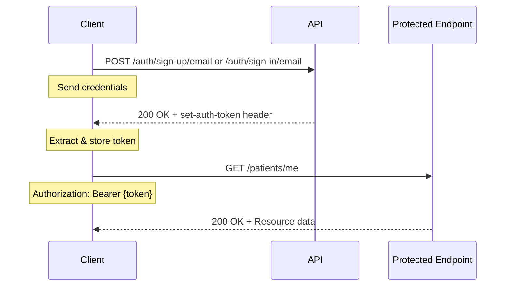
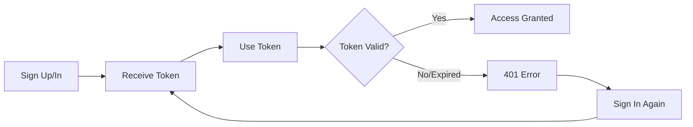

# API Authentication Guide

This guide is for developers integrating with the Monobase API. We use Bearer token authentication for secure API access.

## Overview

The Monobase API uses **Bearer token authentication**. Tokens are cryptographically signed and must be included in the `Authorization` header of protected endpoints.

## Authentication Flow



## Quick Start

### Step 1: Sign Up (New Users)

```bash
curl -X POST http://localhost:7213/auth/sign-up/email \
  -H "Content-Type: application/json" \
  -d '{
    "email": "user@example.com",
    "password": "securepass123",
    "name": "John Doe"
  }' -i
```

**Response Headers:**
```http
HTTP/1.1 200 OK
set-auth-token: eNAnB5w0vD3x3TikNuCU5gPLVg3egR4g.qvb4RbVVp9ctwJb%2FBzevcQJBvXTLNGb6zu%2FzB9%2Bqva8%3D
```

### Step 2: Sign In (Existing Users)

```bash
curl -X POST http://localhost:7213/auth/sign-in/email \
  -H "Content-Type: application/json" \
  -d '{
    "email": "user@example.com",
    "password": "securepass123"
  }' -i
```

### Step 3: Extract Token

Look for the `set-auth-token` header in the response. This is your authentication token.

```bash
# Example: Extract token from response
TOKEN="eNAnB5w0vD3x3TikNuCU5gPLVg3egR4g.qvb4RbVVp9ctwJb%2FBzevcQJBvXTLNGb6zu%2FzB9%2Bqva8%3D"
```

### Step 4: Use Token for Protected Endpoints

Include the token in the `Authorization` header with the `Bearer` prefix:

```bash
curl -X GET http://localhost:7213/patients/me \
  -H "Authorization: Bearer $TOKEN"
```

## Token Format

```
┌─────────────────────────────────────────────────────────────┐
│                         Bearer Token                         │
├──────────────────────┬───────────────────────────────────────┤
│      Session ID      │        URL-Encoded Signature         │
├──────────────────────┼───────────────────────────────────────┤
│   32 characters      │            ~64 characters             │
└──────────────────────┴───────────────────────────────────────┘

Example: eNAnB5w0vD3x3TikNuCU5gPLVg3egR4g.qvb4RbVVp9ctwJb%2FBzevcQJBvXTLNGb6zu%2FzB9%2Bqva8%3D
         └────────── Session ID ──────────┘ └───────── Signature (URL-encoded) ─────────┘
```

⚠️ **IMPORTANT**: Keep the URL encoding intact! Do NOT decode `%2F`, `%3D`, etc.

## Common API Patterns

### Public Endpoints (No Authentication)
```bash
# Readiness check (simple text response)
curl http://localhost:7213/readyz
# Response: "ok" (healthy) or "failed" (unhealthy)

# Readiness check (verbose JSON response)
curl "http://localhost:7213/readyz?verbose"
# Response: {"status":"pass","timestamp":"...","checks":{...}}

# Liveness check
curl http://localhost:7213/livez
# Response: "ok"
```

### Protected Endpoints (Authentication Required)
```bash
# Get current user's patient profile
curl -H "Authorization: Bearer $TOKEN" http://localhost:7213/patients/me

# Create a patient profile
curl -X POST http://localhost:7213/patients \
  -H "Authorization: Bearer $TOKEN" \
  -H "Content-Type: application/json" \
  -d '{"person": {"firstName": "Jane", "lastName": "Doe", ...}}'
```

## Complete Working Example

```bash
#!/bin/bash

# 1. Sign in and capture the full response
RESPONSE=$(curl -X POST http://localhost:7213/auth/sign-in/email \
  -H "Content-Type: application/json" \
  -d '{"email": "test@example.com", "password": "password123"}' \
  -s -i)

# 2. Extract the token from set-auth-token header (keep URL encoding!)
TOKEN=$(echo "$RESPONSE" | grep -i "set-auth-token" | cut -d' ' -f2 | tr -d '\r')

# 3. Use the token to access protected endpoints
curl -X GET http://localhost:7213/patients/me \
  -H "Authorization: Bearer $TOKEN" \
  -s | jq
```

## Error Handling

| Status Code | Error | Solution |
|------------|-------|----------|
| **401 Unauthorized** | Missing or invalid token | Check token is included in `Authorization: Bearer {token}` header |
| **401 Unauthorized** | Token expired | Sign in again to get a new token |
| **403 Forbidden** | Insufficient permissions | User lacks required role/permission for this endpoint |
| **400 Bad Request** | Invalid request body | Check request payload matches API schema |

### Debugging Authentication Issues

```bash
# Verbose output to see headers
curl -v -X GET http://localhost:7213/patients/me \
  -H "Authorization: Bearer $TOKEN"

# Common issues:
# 1. Missing "Bearer " prefix
# 2. Token has been URL-decoded (breaking the signature)
# 3. Token has expired (default: 7 days)
# 4. Extra whitespace in token
```

## Token Lifecycle



## Security Notes

- **Token Expiration**: Tokens expire after 7 days by default
- **Signature Validation**: All tokens are cryptographically signed
- **HTTPS Required**: Always use HTTPS in production
- **Token Storage**: Store tokens securely (never in plain text or logs)
- **No Token Refresh**: Sign in again when token expires

## Additional Resources

- **Better-Auth Documentation**: [https://www.better-auth.com](https://www.better-auth.com)
- **OpenAPI Specification**: `GET /docs/openapi.json`
- **Available Auth Endpoints**: See Better-Auth docs for complete list

## Support

For authentication issues:
1. Verify token format and encoding
2. Check token hasn't expired
3. Ensure proper `Authorization` header format
4. Review server logs for detailed error messages
