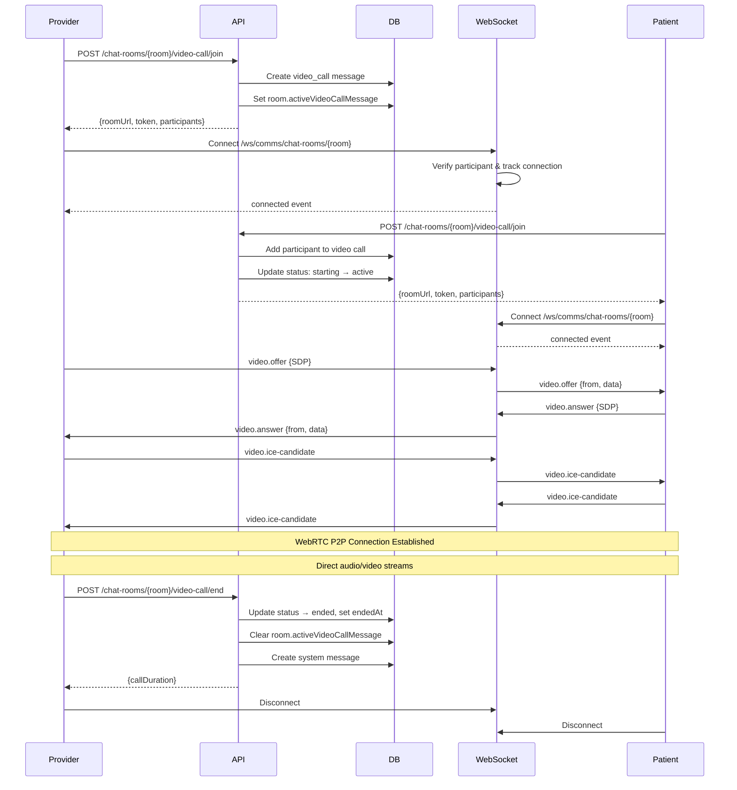
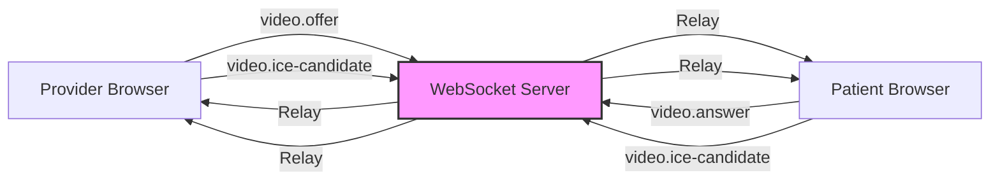
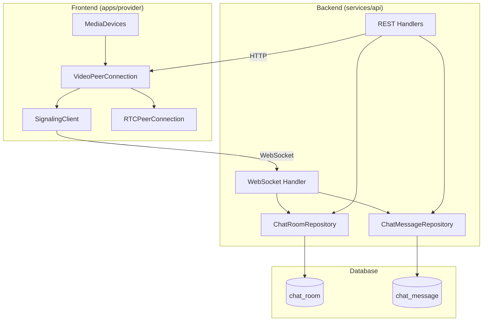

# Video Call Implementation

## Overview

WebRTC-based video consultation system using browser native APIs with self-hosted WebSocket signaling. Supports 1-on-1 video calls between patients and providers with integrated chat functionality.

**Architecture:**
- Browser native WebRTC (RTCPeerConnection)
- Self-hosted WebSocket signaling (Bun + Hono)
- Configurable STUN/TURN servers
- Database-backed call state management
- P2P direct audio/video streams

---

## Architecture

### Video Call Lifecycle



### WebSocket Signaling Flow



### Component Architecture



---

## WebSocket API

### Endpoint

```
GET /ws/comms/chat-rooms/:room
```

**Authentication:** Required (session token via middleware)
**Authorization:** User must be participant in chat room

### Connection Lifecycle

**onConnect:**
- Verify room exists
- Verify user is participant (via patient/provider profiles)
- Track connection in channel: `chat-rooms/{roomId}`
- Send `connected` event to client
- Broadcast `user.joined` event to channel (excluding sender)

**onMessage:**
- Parse JSON message with `{type, data}`
- Route based on message type
- Relay signaling messages to channel participants

**onClose:**
- Untrack connection from channel
- Broadcast `user.left` event to channel

### Message Types

#### 1. Video Signaling Messages

**video.offer**
```typescript
{
  type: 'video.offer',
  data: RTCSessionDescriptionInit
}
```
Relayed as:
```typescript
{
  type: 'video.offer',
  from: string,  // userId (added by server)
  data: RTCSessionDescriptionInit
}
```

**video.answer**
```typescript
{
  type: 'video.answer',
  data: RTCSessionDescriptionInit
}
```
Relayed as:
```typescript
{
  type: 'video.answer',
  from: string,
  data: RTCSessionDescriptionInit
}
```

**video.ice-candidate**
```typescript
{
  type: 'video.ice-candidate',
  data: RTCIceCandidateInit
}
```
Relayed as:
```typescript
{
  type: 'video.ice-candidate',
  from: string,
  data: RTCIceCandidateInit
}
```

#### 2. Chat Messages

**chat.message**
```typescript
{
  type: 'chat.message',
  data: {
    text: string  // max 5000 chars
  }
}
```
- Persisted to database
- Full message object broadcast to channel

**chat.typing**
```typescript
{
  type: 'chat.typing',
  data: {
    isTyping: boolean
  }
}
```
- Not persisted
- Relayed to channel participants

#### 3. Heartbeat

**ping**
```typescript
{
  type: 'ping'
}
```
Response:
```typescript
{
  event: 'pong',
  payload: {
    timestamp: string  // ISO 8601
  }
}
```

### Server Events

**connected**
```typescript
{
  event: 'connected',
  payload: {
    roomId: string,
    userId: string,
    timestamp: string
  }
}
```

**user.joined**
```typescript
{
  event: 'user.joined',
  payload: {
    userId: string,
    timestamp: string
  }
}
```

**user.left**
```typescript
{
  event: 'user.left',
  payload: {
    userId: string,
    timestamp: string
  }
}
```

**error**
```typescript
{
  event: 'error',
  payload: {
    message: string
  }
}
```

---

## REST API Endpoints

### Get ICE Servers

```
GET /comms/ice-servers
```

**Authentication:** Not required
**Response:** 200 OK

```typescript
{
  iceServers: Array<{
    urls: string | string[],
    username?: string,
    credential?: string
  }>
}
```

**Configuration:**
- Set via `WEBRTC_ICE_SERVERS` environment variable (JSON array)
- Default: Google public STUN servers

---

### Join Video Call

```
POST /comms/chat-rooms/{room}/video-call/join
```

**Authentication:** Required
**Authorization:** User must be participant in chat room

**Request Body:**
```typescript
{
  displayName: string,      // Required
  audioEnabled: boolean,    // Default: true
  videoEnabled: boolean     // Default: true
}
```

**Response:** 200 OK
```typescript
{
  roomUrl: string,          // WebSocket signaling URL
  token: string,            // "USE_SESSION_TOKEN" sentinel
  callStatus: string,       // "starting" | "active"
  participants: Array<{
    user: string,
    userType: "patient" | "provider",
    displayName: string,
    joinedAt?: string,
    leftAt?: string,
    audioEnabled: boolean,
    videoEnabled: boolean
  }>
}
```

**Behavior:**
- First participant creates video call message (status: "starting")
- Second participant updates status to "active"
- Subsequent participants join active call
- Rejects if user already in call (409 Conflict)
- Creates system message: "{displayName} joined the video call"

**Room URL Format:**
```
ws://localhost:7213/comms/chat-rooms/{roomId}/video-call/signal
```
or
```
wss://api.example.com/comms/chat-rooms/{roomId}/video-call/signal
```

**Token Usage:**
Clients should use their session token when connecting to WebSocket:
```
Authorization: Bearer {session_token}
```

---

### End Video Call

```
POST /comms/chat-rooms/{room}/video-call/end
```

**Authentication:** Required
**Authorization:** User must be room admin

**Response:** 200 OK
```typescript
{
  message: string,
  callDuration?: number,    // Minutes
  systemMessage?: ChatMessage
}
```

**Behavior:**
- Calculates duration from startedAt to endedAt
- Updates video call status to "ended"
- Clears room.activeVideoCallMessage reference
- Creates system message: "Video call ended by {name} ({duration} minutes)"
- Only room admins can end calls

---

### Leave Video Call

```
POST /comms/chat-rooms/{room}/video-call/leave
```

**Authentication:** Required
**Authorization:** User must be participant in call

**Response:** 200 OK
```typescript
{
  message: string,
  callStillActive: boolean,
  remainingParticipants: number
}
```

**Behavior:**
- Marks participant.leftAt timestamp
- Creates system message: "{displayName} left the video call"
- If no participants remain:
  - Auto-ends call (status: "ended")
  - Clears room.activeVideoCallMessage
  - Creates system message: "Video call ended (no participants remaining)"

---

### Update Participant

```
PATCH /comms/chat-rooms/{room}/video-call/participant
```

**Authentication:** Required
**Authorization:** User must be participant in call

**Request Body:**
```typescript
{
  audioEnabled?: boolean,
  videoEnabled?: boolean
}
```

**Response:** 200 OK
```typescript
{
  user: string,
  userType: "patient" | "provider",
  displayName: string,
  joinedAt: string,
  leftAt?: string,
  audioEnabled: boolean,
  videoEnabled: boolean
}
```

**Behavior:**
- Updates participant's audio/video status in database
- Does NOT send WebSocket notification (client manages local state)

---

## Database Schema

### chat_room Table

```sql
CREATE TABLE chat_room (
  -- Base fields (id, created_at, updated_at, etc.)
  participants JSONB NOT NULL,           -- Array of participant IDs
  admins JSONB NOT NULL,                 -- Array of admin IDs
  context_id UUID,                       -- Generic reference (appointment, etc.)
  status chat_room_status NOT NULL DEFAULT 'active',
  last_message_at TIMESTAMP,
  message_count INTEGER NOT NULL DEFAULT 0,
  active_video_call_message_id UUID     -- Current active call
);
```

**Indexes:**
- GIN index on `participants` and `admins` (JSONB arrays)
- B-tree on `context_id`, `status`, `last_message_at`
- B-tree on `active_video_call_message_id`

### chat_message Table

```sql
CREATE TABLE chat_message (
  -- Base fields (id, created_at, updated_at, etc.)
  chat_room_id UUID NOT NULL REFERENCES chat_room(id),
  sender_id UUID NOT NULL,
  timestamp TIMESTAMP NOT NULL DEFAULT NOW(),
  message_type message_type NOT NULL,    -- 'text' | 'system' | 'video_call'
  message TEXT,                          -- For text/system messages
  video_call_data JSONB                  -- For video_call messages
);
```

**Indexes:**
- B-tree on `chat_room_id`, `sender_id`, `timestamp`, `message_type`
- Compound: (chat_room_id, timestamp)
- Compound: (chat_room_id, message_type)

### Video Call Data Structure (JSONB)

```typescript
interface VideoCallData {
  status: 'starting' | 'active' | 'ended' | 'cancelled',
  roomUrl?: string,
  token?: string,
  startedAt?: string,      // ISO 8601
  endedAt?: string,        // ISO 8601
  durationMinutes?: number,
  participants: Array<{
    user: string,
    userType: 'patient' | 'provider',
    displayName: string,
    joinedAt?: string,
    leftAt?: string,
    audioEnabled: boolean,
    videoEnabled: boolean
  }>
}
```

---

## Call Flow

### Starting a Call

1. **Provider initiates call:**
   - Frontend: `POST /comms/chat-rooms/{room}/video-call/join`
   - Backend creates `video_call` message with status "starting"
   - Backend sets `room.activeVideoCallMessage = message.id`
   - Response includes WebSocket URL and participant list

2. **Provider connects to WebSocket:**
   - Frontend: Connect to `ws://.../comms/chat-rooms/{room}`
   - Backend validates participant, adds to channel
   - Server sends `connected` event

3. **Provider requests media:**
   - Frontend: `navigator.mediaDevices.getUserMedia()`
   - Creates `RTCPeerConnection` with ICE servers from `/comms/ice-servers`

4. **Patient joins call:**
   - Frontend: `POST /comms/chat-rooms/{room}/video-call/join`
   - Backend adds participant to existing call
   - Backend updates status: "starting" → "active"
   - Response includes same WebSocket URL

5. **Patient connects to WebSocket:**
   - Frontend: Connect to same WebSocket channel
   - Backend validates participant, adds to channel

6. **WebRTC negotiation:**
   - Provider creates SDP offer → sends via `video.offer` message
   - Server relays to patient
   - Patient creates SDP answer → sends via `video.answer` message
   - Server relays to provider
   - Both exchange ICE candidates via `video.ice-candidate` messages

7. **P2P connection established:**
   - Direct audio/video streams between browsers
   - Server only relays signaling (no media)

### During Call

**Audio/Video Controls:**
- Frontend toggles `MediaStreamTrack.enabled` property
- Frontend calls `PATCH /comms/chat-rooms/{room}/video-call/participant`
- Updates persisted in database for call history

**Screen Sharing:**
- Frontend: `navigator.mediaDevices.getDisplayMedia()`
- Frontend calls `RTCRtpSender.replaceTrack()` to swap video track
- No backend involvement (pure WebRTC)

**Chat Messages:**
- Send via WebSocket: `{type: 'chat.message', data: {text}}`
- Server persists to database
- Server broadcasts to all channel participants

### Ending Call

**Admin ends call:**
- Frontend: `POST /comms/chat-rooms/{room}/video-call/end`
- Backend calculates duration
- Backend sets status "ended", clears `room.activeVideoCallMessage`
- Frontend closes `RTCPeerConnection` and WebSocket
- Frontend stops all media tracks

**Participant leaves:**
- Frontend: `POST /comms/chat-rooms/{room}/video-call/leave`
- Backend marks `participant.leftAt` timestamp
- If last participant: auto-end call
- Frontend closes connections and stops media

---

## Configuration

### Environment Variables

**WEBRTC_ICE_SERVERS**

JSON array of ICE server configurations:

```bash
WEBRTC_ICE_SERVERS='[
  {"urls": "stun:stun.l.google.com:19302"},
  {"urls": "stun:stun1.l.google.com:19302"},
  {
    "urls": "turn:turn.example.com:3478",
    "username": "user",
    "credential": "pass"
  }
]'
```

**Default value** (if not set):
```javascript
[
  { urls: 'stun:stun.l.google.com:19302' },
  { urls: 'stun:stun1.l.google.com:19302' }
]
```

### Code Reference

Configuration defined in `src/core/config.ts:126-132`:
```typescript
webrtc: {
  iceServers: Array<{
    urls: string | string[];
    username?: string;
    credential?: string;
  }>;
}
```

Parsed in `src/core/config.ts:284-291`:
```typescript
webrtc: {
  iceServers: process.env['WEBRTC_ICE_SERVERS']
    ? JSON.parse(process.env['WEBRTC_ICE_SERVERS'])
    : [
        { urls: 'stun:stun.l.google.com:19302' },
        { urls: 'stun:stun1.l.google.com:19302' }
      ]
}
```

---

## Implementation Files

### Backend
- **WebSocket Handler:** `src/handlers/comms/ws.chat-room.ts`
- **REST Handlers:**
  - `src/handlers/comms/getIceServers.ts`
  - `src/handlers/comms/joinVideoCall.ts`
  - `src/handlers/comms/endVideoCall.ts`
  - `src/handlers/comms/leaveVideoCall.ts`
  - `src/handlers/comms/updateVideoCallParticipant.ts`
- **Repositories:**
  - `src/handlers/comms/repos/chatRoom.repo.ts`
  - `src/handlers/comms/repos/chatMessage.repo.ts`
- **Schema:** `src/handlers/comms/repos/comms.schema.ts`

### Frontend (apps/provider)
- **WebRTC Client:** `src/lib/webrtc/peer-connection.ts`
- **Signaling Client:** `src/lib/webrtc/signaling-client.ts`
- **Media Devices:** `src/lib/webrtc/media-devices.ts`
- **API Client:** `src/api/comms.ts`

---

## Client Integration

### Authentication

**Session Token:**
- Clients extract session token from cookies (Better-Auth)
- Token sent via `Authorization: Bearer {token}` header
- WebSocket validates token via auth middleware
- Frontend token extraction example:
  ```typescript
  const sessionToken = document.cookie
    .split('; ')
    .find(row => row.startsWith('better-auth.session_token='))
    ?.split('=')[1]
  ```

**Connection Flow:**
1. Client calls REST API to join video call
2. API returns WebSocket URL: `ws://.../comms/chat-rooms/{room}`
3. Client connects to WebSocket with `Authorization` header
4. Server validates participant and tracks connection

### WebSocket Client Behavior

**Connection Management:**
- Auto-reconnection with exponential backoff (max 5 attempts)
- Heartbeat via `ping`/`pong` messages
- State tracking: connecting → open → closed/error

**Message Handling:**
- Parse all messages as JSON
- Route based on `event` or `type` field
- Handle connection events: `connected`, `user.joined`, `user.left`
- Handle signaling: `video.offer`, `video.answer`, `video.ice-candidate`
- Handle chat: `chat.message`, `chat.typing`

### WebRTC Client Implementation

**RTCPeerConnection Setup:**
```typescript
const config = {
  iceServers: await fetch('/comms/ice-servers').then(r => r.json())
}
const pc = new RTCPeerConnection(config.iceServers)
```

**Media Stream:**
```typescript
const stream = await navigator.mediaDevices.getUserMedia({
  audio: true,
  video: { width: 1280, height: 720 }
})
stream.getTracks().forEach(track => pc.addTrack(track, stream))
```

**Signaling:**
- Initiator creates offer → sends via `video.offer` message
- Receiver creates answer → sends via `video.answer` message
- Both exchange ICE candidates via `video.ice-candidate` messages

**Screen Sharing:**
```typescript
const displayStream = await navigator.mediaDevices.getDisplayMedia({
  video: { cursor: 'always' },
  audio: false
})
const videoTrack = displayStream.getVideoTracks()[0]
const sender = pc.getSenders().find(s => s.track?.kind === 'video')
await sender.replaceTrack(videoTrack)
```

### Browser Requirements

**Minimum Versions:**
- Chrome 56+ (released 2017)
- Firefox 44+ (released 2016)
- Safari 11+ (released 2017)
- Edge 79+ (Chromium-based)

**Required APIs:**
- `RTCPeerConnection`
- `getUserMedia()`
- `getDisplayMedia()` (for screen sharing)
- `WebSocket`

**Mobile Support:**
- iOS Safari 11+
- Chrome for Android 56+
- May require UX adjustments for small screens

### Network Requirements

**STUN Servers:**
- Required for NAT traversal
- Discovers public IP address
- Default: Google public STUN servers
- Works on most networks

**TURN Servers:**
- NOT configured by default
- Required for very restrictive firewalls/networks
- Can be added via `WEBRTC_ICE_SERVERS` environment variable

**Ports:**
- WebSocket: 7213 (development) or 443 (production wss://)
- WebRTC: Dynamic UDP ports (managed by browser)
- Firewall must allow UDP traffic for P2P connection

---

## Security

**Transport Encryption:**
- WebRTC uses DTLS-SRTP for end-to-end media encryption
- WebSocket signaling over TLS in production (wss://)
- No third-party servers access media streams

**Authentication:**
- All WebSocket connections require session token
- REST endpoints require authentication via Better-Auth middleware

**Authorization:**
- WebSocket: Verify user is participant before allowing connection
- Join call: Verify user is participant in chat room
- End call: Only room admins can end calls
- Leave call: Only current participants can leave
- Update participant: Only current participants can update their status

**Input Validation:**
- Display name required (trimmed)
- Chat messages limited to 5000 characters
- Video call data validated via Zod schemas
- WebSocket messages must be valid JSON

**Data Isolation:**
- WebSocket channels namespaced: `chat-rooms/{roomId}`
- Messages only relayed to participants in same channel
- Database queries filtered by participant authorization

**Compliance:**
- HIPAA-compliant (self-hosted, no external video services)
- Direct P2P media (backend never sees media streams)
- Audit trail in database (join/leave timestamps, call duration)
