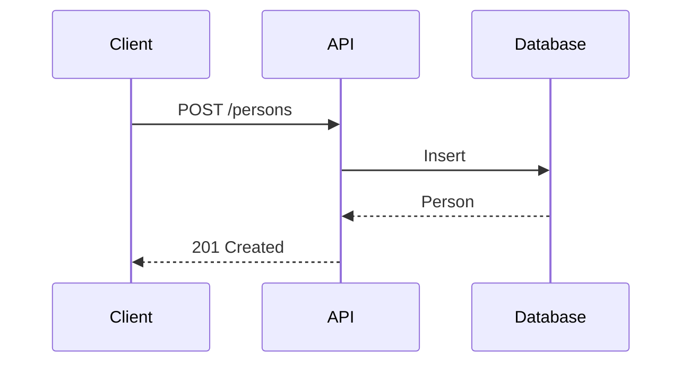
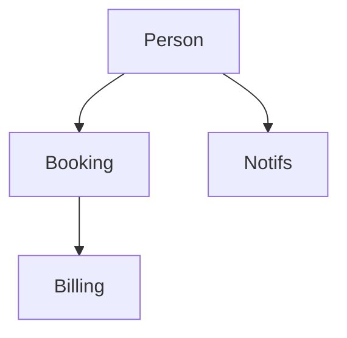

# Documentation Standards

This guide establishes documentation standards for the Monobase Application Platform API specifications.

## Core Principles

1. **Clear and Concise** - Get to the point quickly, avoid jargon
2. **Specification-Focused** - Document what must be built, not implementation details
3. **Maintainable** - Balance completeness with ease of updates
4. **Security-Aware** - Include security and compliance considerations

## Document Structure

### Essential Elements

Every documentation file should include:

1. **Title** - Clear, descriptive heading
2. **Overview** - Purpose, scope, and audience
3. **Content** - Organized into logical sections
4. **Examples** - Concrete illustrations when helpful

### Optional Elements (Use When Valuable)

- Diagrams for complex workflows or architecture
- Code examples for technical specifications
- Tables for structured comparisons
- References to related documentation

## Writing Style

### Language Guidelines

- **Use active voice** - "Define endpoints" not "Endpoints are defined"
- **Be specific** - Provide concrete examples
- **Be consistent** - Use the same terminology throughout
- **Define acronyms** - Explain on first use

### Modal Verbs

- **Must/Required** - Mandatory requirements
- **Should/Recommended** - Best practices
- **May/Optional** - Optional features
- **Can** - Capabilities

### Formatting

- **Bold** for emphasis
- `Code formatting` for technical terms and paths
- Bullet points for lists (3+ items)
- Numbered lists for sequential steps
- Tables for structured data

## TypeSpec Documentation

### Model Documentation

Always include `@doc` decorators:

```typescript
@doc("User profile record")
model Person extends BaseEntity {
  @doc("First name")
  firstName: string;

  @doc("Email address")
  @format("email")
  email?: Email;
}
```

### Operation Documentation

Document endpoints clearly:

```typescript
@post
@summary("Create new person")
@doc("""
  Creates a new person record.
  
  Requires valid email format.
  Returns created person with generated ID.
""")
createPerson(@body request: PersonCreateRequest): Person;
```

## Visual Documentation

### When to Use Diagrams

Use diagrams for:
- Complex workflows
- System architecture
- Multi-step processes
- Module relationships

Keep diagrams simple and up-to-date.

### Sequence Diagrams

For API flows:



### Architecture Diagrams

For module relationships:



## Security Documentation

Always document:
- Authentication requirements
- Required roles/permissions
- Data sensitivity levels
- Audit logging needs

Example:

```typescript
@doc("List persons. Requires admin or support role.")
@get
@useAuth(bearerAuth)
@extension("x-security-required-roles", ["admin", "support"])
listPersons(): PaginatedResponse<Person>;
```

## Code Examples

### Good Examples

```typescript
// ✅ Clear and realistic
model PersonCreateRequest {
  firstName: string;
  lastName?: string;
  email?: Email;
}
```

### Bad Examples

```typescript
// ❌ Vague or unrealistic
model Request {
  data: any;  // What data?
  stuff?: unknown;  // What stuff?
}
```

## Maintenance

### Review Documentation When:
- Adding new features
- Changing APIs
- Updating security patterns
- Refactoring code

### Remove Documentation That Is:
- Outdated or incorrect
- Redundant with other docs
- Overly prescriptive
- No longer relevant

## Anti-Patterns

Avoid:
- ❌ Over-documenting obvious code
- ❌ Under-documenting complex logic
- ❌ Inconsistent terminology
- ❌ Outdated examples
- ❌ Missing context

## Quality Checklist

Good documentation:
- ✅ Is accurate and current
- ✅ Serves its intended audience
- ✅ Is easy to find and navigate
- ✅ Gets updated with code changes
- ✅ Provides concrete examples
- ✅ Uses consistent terminology

## Summary

**Key Takeaway**: Write documentation that helps developers understand and use the API effectively. Keep it clear, concise, and maintainable.

For API-specific patterns, see [DEVELOPMENT.md](./DEVELOPMENT.md).
For security patterns, see [SECURITY.md](./SECURITY.md).
