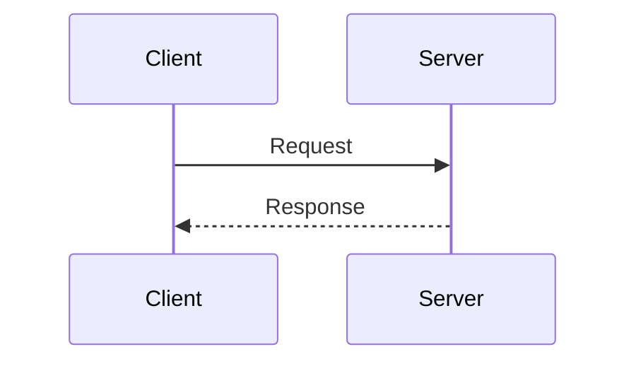
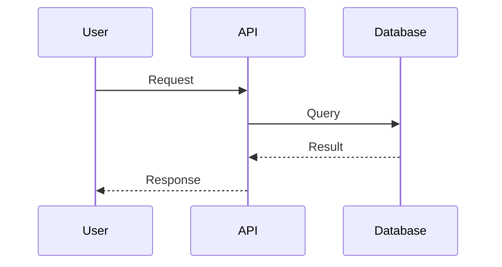
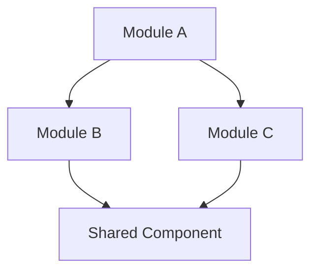

# Documentation Standards Guide

## Introduction

This guide establishes documentation standards for technical documentation within the Monobase Application Platform. These standards ensure consistency and clarity across all technical documentation.

### Purpose
- Establish consistent documentation patterns
- Provide clear technical specifications
- Support effective code reviews
- Enable maintainable documentation

### Target Audience
- **Developers**: Implementation guidance
- **Reviewers**: Code and design reviews
- **Maintainers**: System understanding
- **Contributors**: Project context

### Documentation Philosophy
Documentation **should** be clear, concise, and focused on providing value to readers. It **should** balance completeness with maintainability, avoiding overly prescriptive patterns that become outdated quickly.

## Core Documentation Principles

### 1. Design Specification Approach
Documentation **must**:
- Present requirements and specifications, not implementation details
- Use prescriptive language to guide development
- Focus on "what must be built" rather than "what has been built"
- Maintain implementation neutrality while providing clear guidance

### 2. Security and Compliance Focus
All documentation **shall**:
- Address security compliance requirements explicitly
- Include security and privacy considerations
- Document audit trail requirements
- Specify data protection mechanisms

### 3. Clarity and Precision
Documentation **must**:
- Use clear, unambiguous language
- Avoid jargon without explanation
- Provide concrete examples and specifications
- Include visual representations where appropriate

## Standard Document Structure

Documentation **should follow** a logical structure appropriate to its purpose:

### 1. Document Title
Use clear, descriptive titles that indicate the document's purpose.

Examples:
```markdown
# API Development Guide
# Security Architecture
# Testing Standards
```

### 2. Overview Section
**Recommended Elements**:
- Document purpose
- Key concepts
- Scope and boundaries
- Related documentation

**Example Structure**:
```markdown
## Overview
This document describes [topic]. It covers [scope] and is intended for [audience].
```

### 3. Core Concepts
**Useful Elements**:
- Key principles
- Important patterns
- Common conventions
- Best practices

**Structure**:
```markdown
## Core Concepts

### [Concept Name]
Description of the concept and its importance.
```

### 4. Technical Specifications
**When Appropriate**:
- API contracts
- Data models
- Interface definitions
- Configuration schemas

**Format Guidelines**:
- Use appropriate syntax for the context
- Include helpful comments
- Show both required and optional elements
- Document constraints when relevant

**Example Structure**:
```typescript
interface EntityName {
  // Base Fields
  id: string;              // Description and constraints
  createdAt: Date;         // Automatic timestamp
  
  // Domain Fields
  fieldName: string;       // Required, max 50 characters
  optionalField?: Type;    // Optional, constraints
}
```

### 5. API Documentation
**When Documenting APIs**:
- HTTP methods and paths
- Authentication requirements
- Purpose and usage
- Request/response formats
- Common error scenarios

**Example Format**:
```markdown
### Endpoint Name
`[METHOD] /path/{parameter}`

Description of what the endpoint does.

**Authentication**: Required/Optional/None
**Request**: Description or example
**Response**: Description or example
```

### 6. Examples and Workflows
**When Helpful**:
- Common use cases
- Integration examples
- Process flows
- Decision trees

**Diagram Usage**:
Use diagrams when they add clarity:


### 7. Security Considerations
**Important Topics**:
- Authentication and authorization
- Data protection
- Compliance requirements
- Security best practices

**Format**:
```markdown
## Security and Compliance Requirements

### Role-Based Access Control Specification
The system **must enforce** these access controls:
- **Operation**: Required role(s)

### Audit Logging Requirements
All operations **must be logged** with:
- [Required field 1]
- [Required field 2]
```

### 8. Implementation Notes
**Helpful Additions**:
- Dependencies and prerequisites
- Configuration requirements
- Common patterns
- Known limitations

### 9. Error Handling
**Document When Relevant**:
- Common error scenarios
- Error codes and meanings
- Recovery strategies
- Debugging tips

### 10. Best Practices
**Include When Valuable**:
- Recommended patterns
- Performance considerations
- Common pitfalls
- Tips and tricks

## Language and Style Guidelines

### Clear Communication
Documentation **should** use clear, consistent language:

- **Be Specific**: Avoid vague terms
- **Be Concise**: Get to the point quickly
- **Be Consistent**: Use the same terms throughout
- **Be Helpful**: Focus on what readers need to know

### Modal Verbs
Use modal verbs appropriately:
- **Must/Required**: For mandatory requirements
- **Should/Recommended**: For best practices
- **May/Optional**: For optional features
- **Can/Possible**: For capabilities

### Technical Writing Standards
- Use active voice when possible
- Write in present tense for requirements
- Be specific and concrete
- Avoid ambiguous terms ("various", "some", "etc." without context)
- Define acronyms on first use
- Use consistent terminology throughout

### Formatting Conventions
- **Bold** for emphasis on requirements
- `Code formatting` for technical terms, paths, and values
- Bullet points for lists of 3+ items
- Numbered lists for sequential steps
- Tables for structured comparison data

## Visual Documentation

### When to Use Diagrams
Diagrams **should** be used when they enhance understanding:
- Complex workflows
- System architecture
- Data flows
- State machines

**Good Practices**:
- Keep diagrams simple and focused
- Use clear labels
- Update diagrams when systems change
- Consider the maintenance burden

### Diagram Types and Usage

#### Sequence Diagrams
Use for API workflows, authentication flows, and multi-step processes:


#### Graph Diagrams
Use for architecture relationships and module dependencies:


## Code Documentation

### Inline Documentation
**Guidelines**:
- Document complex logic
- Explain non-obvious decisions
- Include usage examples
- Keep comments up-to-date

**Example**:
```typescript
interface Example {
  // Basic fields with clear names often don't need comments
  id: string;
  name: string;
  
  // Document constraints or special behavior
  code?: string;  // Must match pattern: /^[A-Z]{3}$/
  
  // Explain complex structures
  settings?: {
    enabled: boolean;
    config: unknown;  // Provider-specific configuration
  };
}
```

### Code Example Standards
- Provide realistic, relevant examples
- Include error handling patterns
- Show both success and failure cases
- Add comments explaining key decisions

## Domain-Specific Considerations

### Application-Specific Documentation
When documenting application systems:
- Note compliance requirements
- Document data sensitivity levels
- Include audit requirements
- Reference relevant standards

### Technical Standards
- Reference industry standards when applicable
- Define domain-specific terminology
- Link to external specifications
- Note regulatory requirements

## Review and Maintenance

### Documentation Quality
Good documentation:
- Is accurate and up-to-date
- Serves its intended audience
- Is easy to find and navigate
- Gets updated with code changes

### Maintenance Guidelines
- Review documentation during code reviews
- Update docs when making changes
- Remove outdated information
- Consolidate redundant content

### Quality Indicators
High-quality documentation **exhibits**:
- Clear, unambiguous requirements
- Comprehensive coverage of edge cases
- Practical implementation guidance
- Strong security and compliance focus
- Effective visual representations
- Consistent terminology and style

## Writing Effective Documentation

### Starting Points
When creating new documentation:
- Start with the reader's needs
- Focus on the most important information
- Build incrementally
- Get feedback early

### Complex Topics
When documenting complex systems:
- Break into manageable sections
- Use examples liberally
- Provide multiple perspectives
- Link to detailed references

### Asynchronous Operations
When documenting async systems:
- Explain timing and ordering
- Document retry strategies
- Note performance implications
- Include monitoring guidance

### Performance Documentation
For performance-sensitive areas:
- Document performance goals
- Note optimization strategies
- Include benchmarking data
- Explain trade-offs

## Common Patterns

### Documentation Types
Different purposes require different approaches:

**API Documentation**: Focus on contracts and usage
**Architecture Documentation**: Explain design decisions
**User Guides**: Step-by-step instructions
**Reference Documentation**: Complete specifications

### Anti-Patterns to Avoid
- Over-documenting obvious code
- Under-documenting complex logic
- Outdated examples
- Inconsistent terminology
- Missing context
- Overly prescriptive standards

## Conclusion

These documentation guidelines help create clear, maintainable documentation that serves its intended audience effectively.

### Key Principles
1. **Clarity**: Make information easy to find and understand
2. **Relevance**: Focus on what readers need
3. **Maintainability**: Keep documentation sustainable
4. **Consistency**: Use common patterns and terminology
5. **Value**: Ensure documentation provides real benefit

Good documentation is an investment in the project's future success.