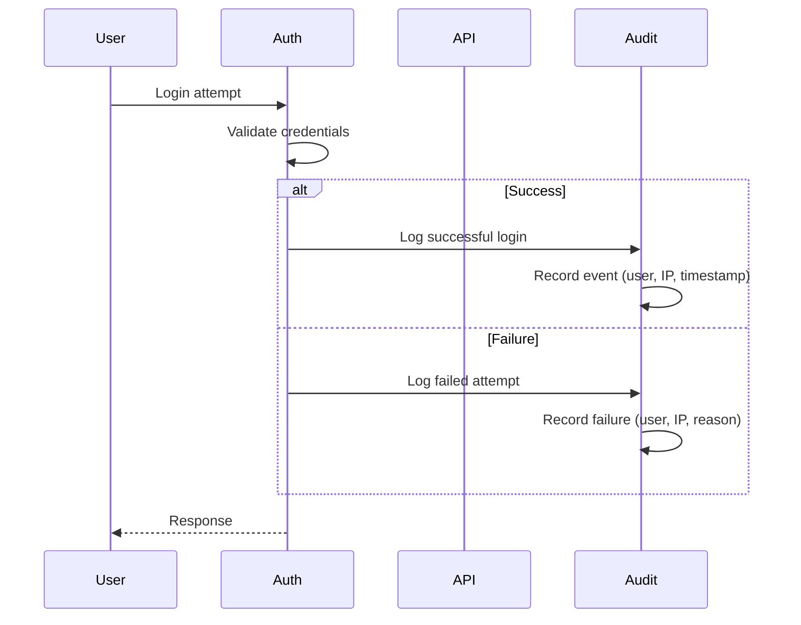
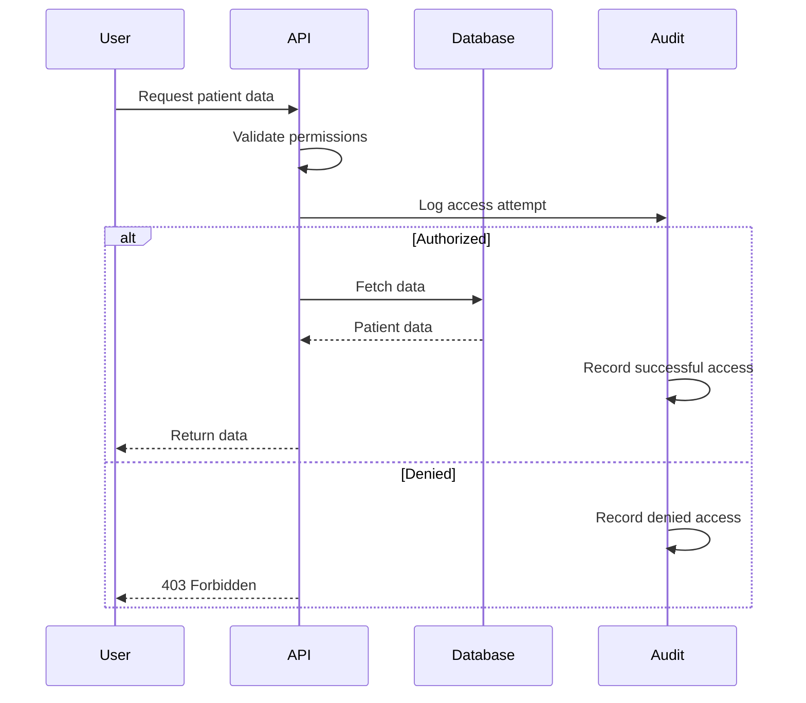
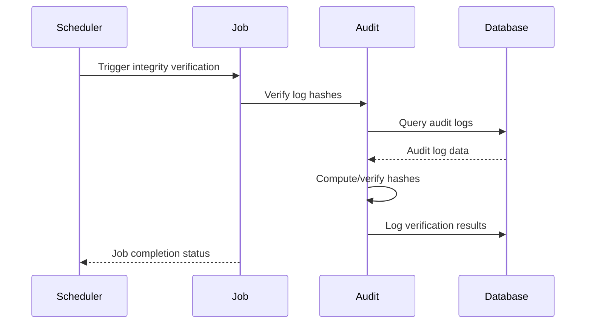

# Audit Module

## Overview

The Audit module serves as the system-wide compliance and security logging infrastructure for the Monobase Application Platform. This module tracks all significant system events, user actions, and data access patterns to ensure compliance and provide comprehensive audit trails.

The module provides a centralized audit logging system that captures security events, data access, modifications, and compliance-related activities across all platform modules.

## Core Concepts

### Event Classification
The system categorizes audit events into distinct types for better organization and compliance reporting:
- Authentication events (login, logout, session management)
- Data access events (viewing records, reports)
- Data modification events (updates, deletions)
- System configuration changes
- Security events (failed access attempts, permission violations)
- Compliance events (consent changes, privacy settings)

### Category-Based Organization
Audit events are organized by compliance categories:
- Security events for threat detection and analysis
- Privacy events for data protection compliance
- Administrative events for system management
- Clinical events for record access
- Financial events for billing and payment tracking

### Action Tracking
The module tracks specific actions performed:
- Create operations for new records
- Read operations for data access
- Update operations for modifications
- Delete operations for removals
- Login/logout for session tracking
- Export operations for data extraction

## Data Models

### AuditLogEntry Entity

```typescript
interface AuditLogEntry {
  // Base Entity Fields
  id: string;              // UUID, system-generated
  createdAt: Date;         // Automatic timestamp
  updatedAt: Date;         // Automatic timestamp
  
  // Event Classification
  eventType: AuditEventType;     // Type of audited event
  category: AuditCategory;       // Compliance category
  action: AuditAction;           // Action performed
  outcome: AuditOutcome;         // Event outcome
  
  // Context Information
  user?: string;                 // User who performed the action
  userType?: "patient" | "provider" | "admin" | "system";
  resourceType: string;          // Type of affected resource
  resource: string;              // Resource identifier
  
  // Event Details
  description: string;           // Human-readable description
  details?: Record<unknown>;     // Additional event details
  
  // Request Context
  ipAddress?: string;            // Client IP address
  userAgent?: string;            // Browser/client information
  session?: string;              // Session identifier
  request?: string;              // Request identifier for correlation
  
  // Integrity and Retention
  integrityHash?: string;        // SHA-256 hash for tamper detection
  retentionStatus: AuditRetentionStatus; // Lifecycle status
  archivedAt?: Date;             // Archive timestamp
  archivedBy?: string;           // Person who archived the log
  purgeAfter?: Date;             // Scheduled purge date
}
```

### Supporting Types

```typescript
enum AuditEventType {
  authentication = "authentication",
  dataAccess = "data-access",
  dataModification = "data-modification",
  systemConfig = "system-config",
  security = "security",
  compliance = "compliance"
}

enum AuditCategory {
  security = "security",
  privacy = "privacy",
  administrative = "administrative",
  clinical = "clinical",
  financial = "financial"
}

enum AuditAction {
  create = "create",
  read = "read",
  update = "update",
  delete = "delete",
  login = "login",
  logout = "logout",
  export = "export"
}

enum AuditOutcome {
  success = "success",
  failure = "failure",
  partial = "partial",
  denied = "denied"
}

enum AuditRetentionStatus {
  active = "active",
  archived = "archived",
  pending_purge = "pending-purge"
}
```

## API Documentation

### List Audit Logs
`GET /audit/logs`

Lists audit logs with filtering and pagination capabilities.

**Authentication**: Required
**Required Roles**: `admin`, `compliance`

**Query Parameters**:
- `entityType`: Filter by entity type
- `entity`: Filter by specific entity ID
- `user`: Filter by user ID
- `action`: Filter by action type
- `startDate`: Filter from date (UTC)
- `endDate`: Filter to date (UTC)
- Standard pagination parameters (limit, offset)

**Response**: `200 OK` with PaginatedResponse<AuditLogEntry>

## Security Considerations

### Access Control
- Only administrators and compliance officers can access audit logs
- Audit logs themselves cannot be modified or deleted
- All audit log access is also audited for compliance

### Data Protection
- Audit logs must be stored in a tamper-proof manner
- Logs should be retained according to compliance requirements (typically 7 years for HIPAA)
- Sensitive data in audit details should be encrypted
- Regular backups of audit logs must be maintained

### Compliance Requirements
The audit module must maintain compliance with:
- Security audit log requirements (who, what, when, where)
- Data retention policies for records
- Chain of custody for security incidents
- Regulatory reporting requirements

## Implementation Notes

### Integration Patterns
The audit module integrates with all other modules through:
- Middleware that automatically logs API access
- Event-driven logging for significant actions
- Database triggers for sensitive data changes
- Correlation IDs for request tracking

### Background Job Integration
The audit module relies on the application's job system for operational tasks:

#### Integrity Verification Jobs
- **Schedule**: Daily at 3 AM (configurable)
- **Function**: Verifies SHA-256 integrity hashes of audit logs
- **Output**: Results logged as audit entries with `eventType: "security"`
- **Integration**: Uses app's job scheduler, no custom endpoints needed

#### Retention Management Jobs
- **Archival Job**: Weekly archival of logs older than 90 days
- **Purge Job**: Annual secure deletion of logs beyond retention period
- **Status Updates**: Updates `retentionStatus`, `archivedAt`, `purgeAfter` fields
- **Integration**: Leverages existing job status endpoints for monitoring

### Performance Optimization
- Asynchronous logging to prevent performance impact
- Batch writes for high-volume events
- Indexed fields for efficient querying
- Partitioned tables for scalability

### Retention Lifecycle Management
- **Active Phase** (0-90 days): `retentionStatus: "active"` - Full query access
- **Archive Phase** (90 days - 7 years): `retentionStatus: "archived"` - Cold storage
- **Purge Phase** (7+ years): `retentionStatus: "pending_purge"` - Scheduled deletion
- **Integrity Tracking**: `integrityHash` field enables tamper detection

## Workflows

### Authentication Audit Flow



### Data Access Audit Flow



### Background Job Audit Flow



## Monitoring and Analytics

### Key Metrics
- Failed authentication attempts (security monitoring)
- Unusual access patterns (anomaly detection)
- Integrity verification results (tamper detection)
- System configuration changes (change management)
- Retention lifecycle progression

### Alerting Thresholds
- Multiple failed login attempts from same IP
- Access to large volumes of patient records
- Unauthorized access attempts
- System configuration modifications
- Integrity verification failures

### Background Job Monitoring
- Daily integrity verification completion status
- Weekly archival job success rates
- Retention policy compliance metrics
- Job failure alerts and retry patterns

## Design Rationale

The Audit module design provides comprehensive compliance logging by:

1. **Centralized Logging**: All audit events flow through a single, consistent system
2. **Immutable Records**: Audit logs cannot be modified or deleted, ensuring integrity
3. **Comprehensive Coverage**: Every significant action is logged with full context
4. **Compliance Focus**: Built specifically for healthcare regulatory requirements
5. **Background Automation**: Routine operations handled by scheduled jobs
6. **Integrity Assurance**: Built-in tamper detection through cryptographic hashing
7. **Lifecycle Management**: Automated retention and archival policies
8. **Performance Optimization**: Asynchronous logging prevents system impact