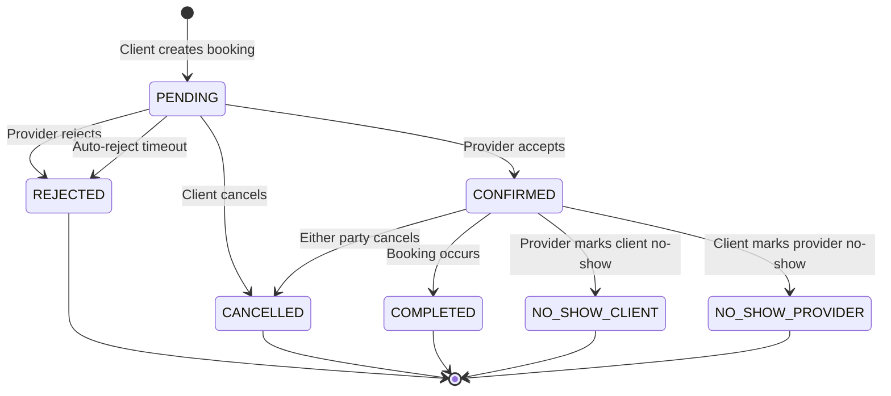
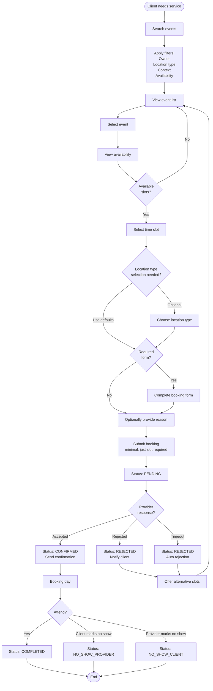
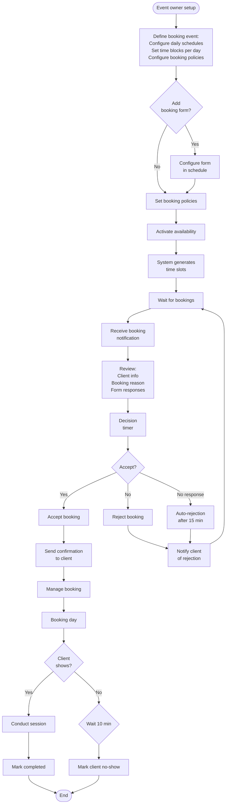
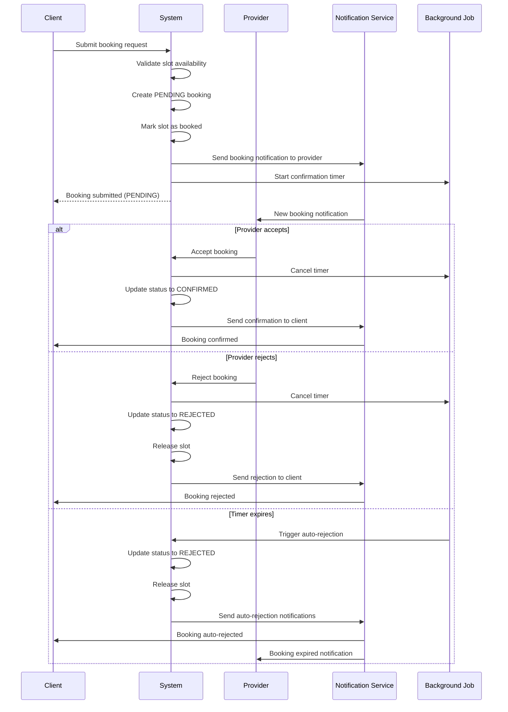

# Booking Module

## Overview

The Booking Module provides a flexible event scheduling system for managing bookings and availability. It offers comprehensive scheduling functionality with support for recurring events, schedule exceptions, time zone management, and payment integration.

## Core Concepts

### Architecture
- **Event-Based System**: Central `BookingEvent` model defines availability schedules
- **Owner-Centric**: Events are owned by users (service providers, organizations, etc.)
- **Slot Generation**: Time slots are automatically generated from booking events
- **Flexible Location Types**: Support for video, phone, and in-person bookings
- **Form Customization**: Configurable intake forms for bookings
- **Billing Integration**: Optional payment requirements with cancellation thresholds

### Key Features
- Weekly schedule configuration with daily time blocks
- Time zone aware scheduling
- Schedule exceptions for blocking time periods
- Recurrence patterns for repeating exceptions
- Configurable booking windows (min/max advance booking)
- Form builder for custom intake forms
- Payment integration with cancellation policies
- Comprehensive booking lifecycle management

## Data Models

### Core Models

#### BookingEvent
The primary model for defining bookable availability:
```typescript
{
  id: UUID                    // Unique identifier
  owner: UUID                 // Event owner (service provider, organization, etc.)
  context?: UUID              // Optional domain association
  timezone: string            // Event timezone (e.g., "America/New_York")
  locationTypes: LocationType[] // Available location types
  maxBookingDays: number      // Max days in advance (0-365)
  minBookingMinutes: number   // Min advance notice (0-4320)
  formConfig?: FormConfig     // Optional form configuration
  billingConfig?: BillingConfig // Optional billing configuration
  status: BookingEventStatus  // Event status (draft, active, paused, archived)
  effectiveFrom: Date         // Schedule start date
  effectiveTo?: Date          // Optional schedule end date
  dailyConfigs: Record<DailyConfig> // Daily schedules by day name
  createdAt: DateTime
  updatedAt: DateTime
}
```

#### TimeSlot
Generated bookable time periods from booking events:
```typescript
{
  id: UUID                    // Unique identifier
  owner: UUID                 // Inherited from event
  event: UUID                 // Source booking event
  context?: UUID              // Inherited from event
  date: Date                  // Slot date
  startTime: DateTime         // UTC start time
  endTime: DateTime           // UTC end time
  locationTypes: LocationType[] // Available location types
  status: SlotStatus          // Availability status
  billingOverride?: BillingConfig // Optional billing override
  booking?: UUID              // Linked booking if booked
  createdAt: DateTime
  updatedAt: DateTime
}
```

#### Booking
Confirmed bookings between clients and service providers:
```typescript
{
  id: UUID                    // Unique identifier
  client: UUID                // Client (person.id)
  provider: UUID              // Provider (person.id)
  slot: UUID                  // Time slot
  locationType: LocationType  // Selected location type
  reason: string              // Booking reason (max 500 chars)
  status: BookingStatus       // Booking status
  bookedAt: DateTime          // When booking was created
  confirmationTimestamp?: DateTime // When provider confirmed
  scheduledAt: DateTime       // Scheduled booking time
  durationMinutes: number     // Duration (15-480 minutes)
  cancellationReason?: string // If cancelled
  cancelledBy?: string        // Who cancelled
  cancelledAt?: DateTime      // When cancelled
  noShowMarkedBy?: string     // Who marked no-show
  noShowMarkedAt?: DateTime   // When marked no-show
  formResponses?: FormResponses // Client's form responses
  invoice?: UUID              // Billing invoice reference
  createdAt: DateTime
  updatedAt: DateTime
}
```

#### ScheduleException
Blocked time periods for specific events:
```typescript
{
  id: UUID                    // Unique identifier
  event: UUID                 // Booking event
  owner: UUID                 // Inherited from event
  context?: UUID              // Inherited from event
  timezone: string            // Exception timezone
  startDatetime: DateTime     // Block start (UTC)
  endDatetime: DateTime       // Block end (UTC)
  reason: string              // Blocking reason (max 500 chars)
  recurring: boolean          // Whether this repeats
  recurrencePattern?: RecurrencePattern // If recurring
  createdAt: DateTime
  updatedAt: DateTime
}
```

### Supporting Models

#### DailyConfig
Configuration for a specific day of the week:
```typescript
{
  enabled: boolean            // Whether this day is enabled
  timeBlocks: TimeBlock[]     // Work periods for this day
}
```

#### TimeBlock
Work period within a day:
```typescript
{
  startTime: string           // HH:MM format (e.g., "09:00")
  endTime: string             // HH:MM format (e.g., "17:00")
  slotDuration?: number       // Minutes per slot (15-480, default: 30)
  bufferTime?: number         // Buffer between bookings (0-120, default: 0)
}
```

#### FormConfig
Configuration for booking forms:
```typescript
{
  fields?: FormFieldConfig[]  // Form field definitions
}
```

#### FormFieldConfig
Individual form field configuration:
```typescript
{
  id: string                  // Field identifier
  type: FormFieldType         // Field type
  label: string               // Field label
  required?: boolean          // Whether required
  options?: FormFieldOption[] // Options for select/multiselect
  validation?: FormFieldValidation // Validation rules
  placeholder?: string        // Placeholder text
  helpText?: string           // Help text
}
```

#### BillingConfig
Billing configuration for events:
```typescript
{
  price: number               // Price in cents
  currency: string            // Currency code (e.g., "CAD", "USD")
  cancellationThresholdMinutes: number // Free cancellation threshold (0-10080)
}
```

#### RecurrencePattern
Pattern for recurring schedule exceptions:
```typescript
{
  type: RecurrenceType        // daily, weekly, monthly
  interval?: number           // Interval between recurrences (default: 1)
  daysOfWeek?: number[]       // For weekly (0=Sunday, 6=Saturday)
  dayOfMonth?: number         // For monthly (1-31)
  endDate?: Date              // End date for recurrence
  maxOccurrences?: number     // Maximum occurrences
}
```

#### FormResponses
Client's form submission data:
```typescript
{
  data: Record<unknown>       // Form field responses
  metadata?: {
    submittedAt?: DateTime    // Submission timestamp
    completionTimeSeconds?: number // Time to complete
    ipAddress?: string        // Client IP
  }
}
```

### Enumerations

#### BookingEventStatus
```typescript
enum BookingEventStatus {
  draft = "draft"             // In draft state
  active = "active"           // Active and accepting bookings
  paused = "paused"           // Temporarily paused
  archived = "archived"       // Archived
}
```

#### BookingStatus
```typescript
enum BookingStatus {
  pending = "pending"         // Pending provider confirmation
  confirmed = "confirmed"     // Confirmed by provider
  rejected = "rejected"       // Rejected by provider
  cancelled = "cancelled"     // Cancelled
  completed = "completed"     // Completed
  no_show_client = "no_show_client"     // Client no-show
  no_show_provider = "no_show_provider" // Provider no-show
}
```

#### SlotStatus
```typescript
enum SlotStatus {
  available = "available"     // Available for booking
  booked = "booked"           // Booked
  blocked = "blocked"         // Blocked
}
```

#### LocationType
```typescript
enum LocationType {
  video = "video"             // Video call
  phone = "phone"             // Phone call
  in-person = "in-person"     // In-person meeting
}
```

#### RecurrenceType
```typescript
enum RecurrenceType {
  daily = "daily"             // Daily recurrence
  weekly = "weekly"           // Weekly recurrence
  monthly = "monthly"         // Monthly recurrence
}
```

## Use Cases

### Service Provider Setting Up Availability
1. Service provider creates a BookingEvent with weekly schedule
2. System generates TimeSlots based on the schedule
3. Provider can add ScheduleExceptions for vacations/breaks
4. Clients can discover and book available slots

### Client Booking Process
1. Client searches events via public discovery endpoint
2. Client views available slots for selected event
3. Client creates booking for desired slot
4. Provider receives notification and confirms/rejects
5. Both parties can cancel with proper notice

### Schedule Management
1. Provider updates BookingEvent to modify availability
2. System regenerates future slots (preserving booked ones)
3. Provider adds exceptions for specific dates/times
4. Recurring exceptions handle regular breaks

### Payment Flow (when configured)
1. BookingEvent includes BillingConfig with pricing
2. Client books, invoice is created
3. Payment is processed before confirmation
4. Cancellation policy enforced based on threshold

## Implementation Notes

### Time Zone Handling
- BookingEvents store timezone for schedule definition
- All API times are in UTC for consistency
- Slots are generated in UTC from local schedule times
- Client applications handle timezone conversion

### Slot Generation Strategy
- Slots are pre-generated for discovery efficiency
- Generation happens on schedule changes
- Buffer time ensures adequate breaks
- Overlapping exceptions are handled gracefully

### Access Control Patterns
- Owner-based access for event management
- Role-based access for bookings
- Public access for event discovery
- Audit trail via action reason fields

### Scalability Considerations
- Slot pre-generation for query performance
- Pagination on all list endpoints
- Selective field expansion via expand parameter
- Efficient filtering via database indexes

## Workflows

### Booking Status Lifecycle



### Client Booking Flow



### Weekly Schedule Creation

Service providers manage their entire weekly availability through a single atomic operation, supporting complex schedules with multiple time blocks per day.

#### Default Values

When creating a new weekly schedule, the following defaults are automatically applied:

| Field | Default Value | Description |
|-------|---------------|-------------|
| `timezone` | "America/New_York" | Eastern Time (most common US timezone) |
| `locationTypes` | All available | video, phone, in-person |
| `maxBookingDays` | 30 | Clients can book up to 30 days ahead |
| `minBookingMinutes` | 1440 | Minimum 24-hour advance notice |
| `effectiveFrom` | Today's date | Schedule starts immediately |
| `status` | active | Schedule is active upon creation |

For daily configurations and time blocks:

| Field | Default Value | Description |
|-------|---------------|-------------|
| `enabled` | false | Days are disabled by default |
| `slotDuration` | 30 | 30-minute booking slots |
| `bufferTime` | 0 | No buffer between bookings |

#### Example Weekly Schedule Creation

**Minimal Schedule (works Mon-Fri, 9-5):**
```json
{
  "dailyConfigs": {
    "mon": { "enabled": true, "timeBlocks": [{"startTime": "09:00", "endTime": "17:00"}] },
    "tue": { "enabled": true, "timeBlocks": [{"startTime": "09:00", "endTime": "17:00"}] },
    "wed": { "enabled": true, "timeBlocks": [{"startTime": "09:00", "endTime": "17:00"}] },
    "thu": { "enabled": true, "timeBlocks": [{"startTime": "09:00", "endTime": "17:00"}] },
    "fri": { "enabled": true, "timeBlocks": [{"startTime": "09:00", "endTime": "17:00"}] }
  }
}
```

**Complex Schedule (with breaks and different hours):**
```json
{
  "timezone": "America/Los_Angeles",
  "dailyConfigs": {
    "mon": { 
      "enabled": true, 
      "timeBlocks": [
        {"startTime": "08:00", "endTime": "12:00", "slotDuration": 30},
        {"startTime": "13:00", "endTime": "17:00", "slotDuration": 45}
      ]
    },
    "wed": { 
      "enabled": true, 
      "timeBlocks": [
        {"startTime": "09:00", "endTime": "12:00"},
        {"startTime": "14:00", "endTime": "18:00"},
        {"startTime": "19:00", "endTime": "21:00", "slotDuration": 30}
      ]
    }
  }
}
```

#### Benefits of Weekly Schedule Model

1. **Atomic Operations**: Save or cancel entire week at once
2. **Complex Schedules**: Support for breaks, split shifts, and varying slot durations
3. **Consistent Configuration**: Week-level settings apply uniformly
4. **Flexible Time Blocks**: Different hours and slot durations throughout the day
5. **True Weekly Editor UX**: Matches provider mental model of weekly planning

### Event Owner Management Flow



### Booking Confirmation Sequence



## Business Rules

### Scheduling Rules

1. **Recurring Patterns**: Providers define weekly recurring schedules, not individual slots
2. **Slot Generation**: System automatically generates bookable slots based on:
   - Provider's weekly schedule
   - Slot duration + buffer time
   - Schedule exceptions (blocked times)
   - Maximum advance booking window (e.g., 30 days)
3. **Advance Booking**: 
   - Minimum: Configured per provider (e.g., 24 hours ahead)
   - Maximum: Configured per provider (e.g., 30 days ahead)
4. **Conflict Prevention**: No double-booking of the same time slot
5. **Time Zone Handling**: All times stored in UTC, displayed in user's local timezone

### Booking Rules

1. **Future Only**: Clients can only book future bookings
2. **Single Pending**: Maximum one pending booking per client-provider pair
3. **Immediate Hold**: Booking immediately marks slot as unavailable
4. **Confirmation Window**: Provider has 15 minutes to accept/reject
5. **Auto-Rejection**: System automatically rejects unconfirmed bookings after 15 minutes
6. **Simplified Creation**: Only slot ID required; locationType and reason are optional
7. **Smart Defaults**: Missing locationType defaults to slot's first available option
8. **Form Requirements**: If event has required forms, must be completed during booking

### Cancellation Rules

1. **Status Requirement**: Only CONFIRMED bookings can be cancelled
2. **Both Parties**: Either client or provider can cancel
3. **Reason Required**: Cancellation must include a reason
4. **Time Windows**: 
   - Free cancellation: Based on event's cancellationThresholdMinutes
   - Late cancellation: Within threshold (may incur fees)
5. **Pattern Tracking**: System tracks cancellation patterns for policy enforcement

### No-Show Rules

1. **Client Timer**: Can mark provider as no-show 5 minutes after scheduled time
2. **Provider Timer**: Can mark client as no-show 10 minutes after scheduled time
3. **Exclusivity**: Only one party can mark no-show per booking
4. **Finality**: No-show marking cannot be reversed
5. **Consequences**: No-show history affects:
   - User reputation scores
   - Booking privileges
   - Platform access (after repeated violations)

### Form Rules

1. **Configuration**: Forms are configured directly in booking events (formConfig field)
2. **Requirement Levels**: Forms can be required or optional
3. **Submission Timing**: 
   - Required forms: Must complete during booking process
   - Form responses included in booking creation request (data field only)
4. **Immutability**: Form responses are immutable after booking creation
5. **Data Storage**: Form responses stored directly in booking record (formResponses field)
6. **Metadata Generation**: System automatically generates metadata (timestamp, IP, completion time)

#### Booking Forms

Booking forms are configured in the event and responses are stored with each booking.

##### Form Configuration Structure

Forms are defined in the `formConfig` field of booking events:

```json
{
  "fields": [
    {
      "id": "emergency_contact",
      "type": "text",
      "label": "Emergency Contact Name",
      "required": true,
      "validation": {
        "maxLength": 100
      }
    },
    {
      "id": "consent_text",
      "type": "display",
      "label": "Terms and Conditions",
      "helpText": "By proceeding, you acknowledge the terms of service."
    },
    {
      "id": "consent_acceptance",
      "type": "checkbox",
      "label": "I accept the terms and conditions",
      "required": true
    }
  ]
}
```

##### Field Types

| Type | Input | Response | Notes |
|------|-------|----------|-------|
| `text` | Single line | string | |
| `textarea` | Multi-line | string | |
| `email` | Email | string | |
| `phone` | Phone number | string | |
| `number` | Numeric | number | |
| `datetime` | Date/time picker | ISO 8601 string | Input with timezone, stored as UTC |
| `select` | Dropdown | string | Stores option value |
| `multiselect` | Checkboxes | string[] | Array of option values |
| `checkbox` | Single checkbox | boolean | |
| `display` | Display only | none | No data stored |

##### Form Response Structure

Responses are stored in the `formResponses` field of bookings:

```json
{
  "data": {
    "emergency_contact": "Jane Doe",
    "phone_number": "+1-555-0123",
    "special_requests": ["wheelchair_access", "interpreter"],
    "preferred_time": "2024-11-10T13:30:00Z",
    "consent_acceptance": true
  },
  "metadata": {
    "submittedAt": "2024-11-15T10:30:00Z",
    "completionTimeSeconds": 180,
    "ipAddress": "192.168.1.1"
  }
}
```

**Note**: During booking creation, clients only provide the `data` field. The `metadata` field is automatically generated by the system.

### Schedule Exception Rules

Schedule exceptions allow providers to block specific time periods when they're unavailable (holidays, breaks, other commitments, etc.).

##### Exception Types

1. **One-Time Exception**: Block a specific date/time
   - Example: December 25, 2024 (Holiday)
   - Effect: No slots generated for that period

2. **Time Range Exception**: Block partial day
   - Example: November 28, 2024, 2:00 PM - 5:00 PM (leaving early)
   - Effect: Afternoon slots not generated

3. **Recurring Exception**: Regular blocked periods
   - Example: Every Monday 12:00 PM - 1:00 PM (lunch break)
   - Effect: Pattern applied to all future occurrences

##### Slot Generation Behavior

When generating time slots, the system checks for overlapping exceptions:

```
For each potential slot:
  If slot overlaps with any exception:
    Skip slot creation (don't generate)
  Else:
    Create available slot
```

**Implementation Approach**: Don't generate blocked slots
- No slots created during exception periods
- Cleaner database with fewer rows
- Simpler queries without status filtering
- Exception times simply appear as gaps in availability

##### Exception Creation and Modification

When exceptions are created or modified:

1. **Available Slots**: Delete any overlapping available slots immediately
2. **Booked Slots**: Never affected automatically
   - Remain unchanged
   - Provider manually handles any conflicts
   - System flags conflicts for provider attention
3. **Client Visibility**: Exception periods don't appear as bookable options

##### Conflict Management

1. **Conflict Detection**: System identifies when exceptions overlap with existing bookings
2. **Provider Notification**: Flagged conflicts shown to provider
3. **Manual Resolution**: Provider contacts affected clients directly
4. **No Auto-Rescheduling**: System never automatically moves or cancels booked bookings

### Weekly Schedule Change Management

#### Schedule Lifecycle Operations

##### Weekly Schedule Deletion
When a weekly schedule is deleted, the system handles existing data as follows:

1. **Future Available Slots**: Delete all immediately (entire week's unbooked slots)
2. **Future Booked Slots**: Preserve (bookings remain valid and will occur)
3. **Client Notifications**: Only sent if booked bookings exist
4. **Audit Trail**: Maintain deletion record for compliance

##### Weekly Schedule Deactivation
Deactivation temporarily stops all availability without losing configuration:

1. **Slot Generation**: Stop immediately (no new slots created)
2. **Existing Available Slots**: Delete all (can regenerate when reactivated)
3. **Existing Booked Slots**: Preserve (bookings remain valid)
4. **Reactivation**: Regenerates slots for entire week from reactivation point forward

##### Weekly Schedule Updates
Updates benefit from atomic operations - all changes are applied together:

**Minor Changes** (no slot regeneration required):
- `formConfig` - Form questions and requirements
- `locationTypes` - Available location types
- `maxBookingDays` - How far ahead clients can book
- `minBookingMinutes` - Minimum advance notice required

**Major Changes** (require slot regeneration for affected days):
- Adding/removing time blocks from any day
- Changing time block hours (startTime/endTime)
- Modifying `slotDuration` in any time block
- Modifying `bufferTime` in any time block
- Enabling/disabling days (`enabled` flag)
- Changing `timezone` (affects entire week)

#### Time Slot Regeneration Strategy

When major schedule changes occur, the system regenerates future available slots:

1. **Effective Timing**: Changes apply from the next bookable slot
   - Calculate: Current time + minBookingMinutes
   - Round up to next slot boundary to avoid partial slots
   - Example: If current time is 2:00 PM and minBookingMinutes is 120, changes apply from 4:00 PM

2. **Regeneration Process**:
   ```
   1. Identify affected time range (from next bookable slot forward)
   2. Delete all available slots in that range
   3. Generate new slots based on updated schedule
   4. Preserve all booked slots (never modified)
   ```

3. **Slot Boundary Alignment**:
   - Calculate proper slot boundaries based on slotDuration + bufferTime
   - Ensure no partial or misaligned slots are created
   - Maintain consistent slot grid throughout the day

#### Data Integrity Principles

1. **Transaction Boundaries**: All schedule changes and slot updates occur within database transactions
2. **Booked Slot Protection**: Booked bookings are immutable - never modified or deleted
3. **Available Slot Flexibility**: Available slots can be freely deleted and regenerated
4. **Race Condition Prevention**: 
   - Lock slots during booking process
   - Validate slot availability at booking time
   - Handle concurrent modifications gracefully

5. **Cascade Rules**:
   - Schedule deletion restricted if booked bookings exist
   - Slot deletion cascades to remove references
   - Maintain referential integrity across all relationships

### Billing Integration

The booking module integrates with the billing module for paid bookings:

#### Price Configuration
- **TimeSlot.price**: Optional field specifying the price for a slot
- **BookingEvent.billingConfig**: Optional default billing configuration for all slots in an event
- Price is determined by the platform, not set by providers directly

#### Invoice Creation
When creating a paid booking:

```typescript
// In booking creation handler
if (slot.price || event.billingConfig) {
  const invoice = await billingAPI.createInvoice({
    customer: booking.client,
    merchant: provider,
    context: `booking:${booking.id}`, // Prevents duplicate invoices
    total: slot.price || event.billingConfig.price,
    lineItems: [{
      description: `Service booking with ${providerName}`,
      unitPrice: slot.price || event.billingConfig.price,
      quantity: 1,
      metadata: { 
        type: "booking", 
        reference: booking.id 
      }
    }]
  });
  booking.invoice = invoice.id;
}
```

#### Key Integration Points
1. **Invoice Reference**: Bookings store optional `invoice` UUID field
2. **Context Field**: Uses `booking:{id}` pattern for idempotency
3. **Payment Flow**: Handled entirely by billing module
4. **Cancellation**: Billing module handles refunds separately based on cancellationThresholdMinutes

#### Data Cleanup Strategy

Past available slots serve no purpose and consume database resources. The system uses database-level optimizations to handle this efficiently.

##### Cleanup Philosophy

1. **Past Available Slots**: Useless data that should be excluded from queries
2. **Past Booked Slots**: Valuable booking history that must be preserved
3. **Approach**: Use database features instead of manual cleanup jobs

##### Recommended Strategy: Partial Indexes

Instead of deleting old available slots, exclude them using partial indexes:

```sql
-- Index only includes future available slots
CREATE INDEX idx_bookable_slots ON time_slots 
  (owner, date, startTime)
  WHERE status = 'available' AND date >= CURRENT_DATE;
```

**Benefits:**
- Past available slots exist but are "invisible" to queries
- No cleanup jobs needed
- No deletion overhead or database bloat
- Queries automatically skip irrelevant data

##### Query Optimization

Queries automatically benefit from the partial index:

```sql
-- This query only scans future available slots
SELECT * FROM time_slots 
WHERE owner = ? 
  AND status = 'available' 
  AND date >= CURRENT_DATE;
-- Past slots are ignored without explicit filtering
```

##### Data Retention Rules

| Data Type | Retention | Reason |
|-----------|-----------|---------|
| Past available slots | Excluded from index | No business value |
| Past booked slots | Permanent | Booking history |
| Completed bookings | Permanent | Service records |
| Cancelled bookings | Permanent | Audit trail |
| No-show bookings | Permanent | Pattern tracking |

## API Endpoints

### Event Management

#### List Booking Events (Public Discovery)
```http
GET /booking/events
No authentication required

Query Parameters:
- owner?: UUID               // Filter by event owner
- context?: UUID             // Filter by context
- locationType?: LocationType // Filter by location type
- status?: BookingEventStatus // Filter by status (default: active)
- availableFrom?: DateTime   // Filter events with slots after this time
- availableTo?: DateTime     // Filter events with slots before this time
- expand?: string            // Expand related resources (e.g., "slots")
- page?: number
- size?: number

Response: 200 OK
{
  data: BookingEvent[],
  metadata: PaginationMetadata
}
```

#### Create Booking Event
```http
POST /booking/events
Authorization: Bearer <token>
Required Role: user

Request:
{
  context?: UUID              // Optional domain association
  timezone?: string           // Default: "America/New_York"
  locationTypes?: LocationType[] // Default: all types
  maxBookingDays?: number     // Default: 30
  minBookingMinutes?: number  // Default: 1440 (24 hours)
  formConfig?: FormConfig     // Optional form configuration
  billingConfig?: BillingConfig // Optional billing
  status?: BookingEventStatus // Default: "active"
  effectiveFrom?: Date        // Default: today
  effectiveTo?: Date          // Optional end date
  dailyConfigs: {             // Required daily schedules
    mon: { enabled: true, timeBlocks: [...] },
    tue: { enabled: true, timeBlocks: [...] },
    // ... other days
  }
}

Response: 201 Created
{
  id: UUID,
  owner: UUID,                // Auto-set to authenticated user
  // ... full BookingEvent object
}
```

#### Get Booking Event
```http
GET /booking/events/{event}
Authorization: Bearer <token>
Required Role: event:owner, admin, support

Response: 200 OK
{
  // ... BookingEvent object
}
```

#### Update Booking Event
```http
PATCH /booking/events/{event}
Authorization: Bearer <token>
Required Role: event:owner, admin

Request (partial updates supported):
{
  timezone?: string
  locationTypes?: LocationType[]
  maxBookingDays?: number
  minBookingMinutes?: number
  formConfig?: FormConfig
  billingConfig?: BillingConfig
  status?: BookingEventStatus
  effectiveTo?: Date
  dailyConfigs?: Record<DailyConfig>
}

Response: 200 OK
{
  // ... updated BookingEvent object
}
```

#### Delete Booking Event
```http
DELETE /booking/events/{event}
Authorization: Bearer <token>
Required Role: event:owner, admin

Response: 204 No Content
```

### Schedule Exception Management

#### Create Schedule Exception
```http
POST /booking/events/{event}/exceptions
Authorization: Bearer <token>
Required Role: event:owner, admin

Request:
{
  timezone?: string           // Defaults to event timezone
  startDatetime: DateTime     // Block start
  endDatetime: DateTime       // Block end
  reason: string              // Blocking reason
  recurring?: boolean         // Whether this repeats
  recurrencePattern?: RecurrencePattern // If recurring
}

Response: 201 Created
{
  id: UUID,
  event: UUID,
  owner: UUID,                // Inherited from event
  // ... full ScheduleException object
}
```

#### List Schedule Exceptions
```http
GET /booking/events/{event}/exceptions
Authorization: Bearer <token>
Required Role: event:owner, admin, support

Query Parameters:
- page?: number
- size?: number

Response: 200 OK
{
  data: ScheduleException[],
  metadata: PaginationMetadata
}
```

#### Get Schedule Exception
```http
GET /booking/events/{event}/exceptions/{exception}
Authorization: Bearer <token>
Required Role: event:owner, admin, support

Response: 200 OK
{
  // ... ScheduleException object
}
```

#### Delete Schedule Exception
```http
DELETE /booking/events/{event}/exceptions/{exception}
Authorization: Bearer <token>
Required Role: event:owner, admin

Response: 204 No Content
```

### Slot Discovery (Public)

#### Get Time Slot
```http
GET /booking/slots/{slotId}
No authentication required

Query Parameters:
- expand?: string             // Expand related resources

Response: 200 OK
{
  // ... TimeSlot object
}
```

### Booking Management

#### Create Booking
```http
POST /booking/bookings
Authorization: Bearer <token>
Required Role: user

Request:
{
  slot: UUID                  // Required time slot
  locationType?: LocationType // Defaults to slot's first type
  reason?: string             // Booking reason (max 500)
  formResponses?: {           // Optional form responses
    data: Record<unknown>
  }
}

Response: 201 Created
{
  id: UUID,
  client: UUID,               // Auto-set to authenticated user
  provider: UUID,             // From slot
  status: "pending",          // Initial status
  // ... full Booking object
}
```

#### List Bookings
```http
GET /booking/bookings
Authorization: Bearer <token>
Required Role: client:owner, provider:owner, admin, support

Query Parameters:
- provider?: UUID             // Filter by provider
- client?: UUID               // Filter by client
- status?: BookingStatus      // Filter by status
- startDate?: Date            // Filter start date
- endDate?: Date              // Filter end date
- expand?: string             // Expand related resources
- page?: number
- size?: number

Response: 200 OK
{
  data: Booking[],
  metadata: PaginationMetadata
}
```

#### Get Booking
```http
GET /booking/bookings/{booking}
Authorization: Bearer <token>
Required Role: client:owner, provider:owner, admin, support

Query Parameters:
- expand?: string             // Expand related resources

Response: 200 OK
{
  // ... Booking object
}
```

#### Confirm Booking
```http
POST /booking/bookings/{booking}/confirm
Authorization: Bearer <token>
Required Role: provider:owner, admin

Request:
{
  reason: string              // Confirmation reason for audit
}

Response: 200 OK
{
  // ... Booking with status: "confirmed"
}
```

#### Reject Booking
```http
POST /booking/bookings/{booking}/reject
Authorization: Bearer <token>
Required Role: provider:owner, admin

Request:
{
  reason: string              // Rejection reason for audit
}

Response: 200 OK
{
  // ... Booking with status: "rejected"
}
```

#### Cancel Booking
```http
POST /booking/bookings/{booking}/cancel
Authorization: Bearer <token>
Required Role: client:owner, provider:owner, admin

Request:
{
  reason: string              // Cancellation reason
}

Response: 200 OK
{
  // ... Booking with status: "cancelled"
}
```

#### Mark No-Show
```http
POST /booking/bookings/{booking}/no-show
Authorization: Bearer <token>
Required Role: client:owner, provider:owner, admin

Request:
{
  reason: string              // No-show reason
}

Response: 200 OK
{
  // ... Booking with appropriate no-show status
}
```

## Security Considerations

### Authentication & Authorization

All booking endpoints follow the established security patterns from the platform's RBAC system.

### Security Requirements by Endpoint

| Endpoint | Method | Security | Required Roles | Notes |
|----------|--------|----------|----------------|-------|
| **Event Management** | | | | |
| `/booking/events` | GET | None | Public | Event discovery |
| `/booking/events` | POST | Bearer | `user` | Create event |
| `/booking/events/{event}` | GET | Bearer | `event:owner`, `admin`, `support` | Get event details |
| `/booking/events/{event}` | PATCH | Bearer | `event:owner`, `admin` | Update event |
| `/booking/events/{event}` | DELETE | Bearer | `event:owner`, `admin` | Delete event |
| **Exception Management** | | | | |
| `/booking/events/{event}/exceptions` | POST | Bearer | `event:owner`, `admin` | Create exception |
| `/booking/events/{event}/exceptions` | GET | Bearer | `event:owner`, `admin`, `support` | List exceptions |
| `/booking/events/{event}/exceptions/{exception}` | GET | Bearer | `event:owner`, `admin`, `support` | Get exception |
| `/booking/events/{event}/exceptions/{exception}` | DELETE | Bearer | `event:owner`, `admin` | Delete exception |
| **Slot Discovery** | | | | |
| `/booking/slots/{slotId}` | GET | None | Public | Slot details |
| **Booking Management** | | | | |
| `/booking/bookings` | POST | Bearer | `user` | Create booking |
| `/booking/bookings` | GET | Bearer | `client:owner`, `provider:owner`, `admin`, `support` | List bookings (filtered by role) |
| `/booking/bookings/{booking}` | GET | Bearer | `client:owner`, `provider:owner`, `admin`, `support` | View booking |
| `/booking/bookings/{booking}/confirm` | POST | Bearer | `provider:owner`, `admin` | Confirm booking |
| `/booking/bookings/{booking}/reject` | POST | Bearer | `provider:owner`, `admin` | Reject booking |
| `/booking/bookings/{booking}/cancel` | POST | Bearer | `client:owner`, `provider:owner`, `admin` | Cancel booking |
| `/booking/bookings/{booking}/no-show` | POST | Bearer | `client:owner`, `provider:owner`, `admin` | Mark no-show |

### Role-Based Filtering

The `GET /booking/bookings` endpoint automatically filters results based on the user's role:

**Client Access** (`client:owner`):
```http
GET /booking/bookings
Authorization: Bearer <client-token>
# Returns only the client's bookings
```

**Provider Access** (`provider:owner`):
```http
GET /booking/bookings?provider=<provider-id>
Authorization: Bearer <provider-token>
# Returns bookings for that provider (if owner)
```

**Admin/Support Access** (`admin`, `support`):
```http
GET /booking/bookings
GET /booking/bookings?client=<client-id>
GET /booking/bookings?provider=<provider-id>
Authorization: Bearer <admin-token>
# Can access any bookings with optional filtering
```

### Public Access Patterns

**Event Discovery** - No authentication required:
```http
GET /booking/events?status=active&locationType=video&expand=slots
# Public access to event list with availability
```

**Individual Slot** - No authentication required:
```http
GET /booking/slots/abc123
# Public access to slot details
```

### Owner Permission Logic

- **`client:owner`**: Client can only access their own bookings
- **`provider:owner`**: Provider can only access bookings where they are the provider
- **`event:owner`**: Event owner can only manage their own events
- **Resource ownership** is determined by comparing the authenticated user's ID with the resource's client/provider/owner fields
- **Admin/Support** roles bypass ownership checks and can access any resource

### Security Notes

1. Public Discovery: Event search and slot availability are public to enable client discovery
2. Booking Creation: Requires authenticated user to prevent anonymous bookings
3. Provider Actions: Only providers can confirm/reject their own bookings
4. Mutual Cancellation: Both client and provider can cancel confirmed bookings
5. No-Show Rights: Both parties can mark the other as no-show with timing restrictions
6. Admin Override: Admin role can perform any action for support purposes

## Notifications

### Client Notifications

| Event | Trigger | Content |
|-------|---------|---------|
| Booking Submitted | Booking created | Confirmation of pending booking |
| Booking Confirmed | Provider accepts | Booking details, meeting info |
| Booking Rejected | Provider rejects or timeout | Rejection reason, rebooking options |
| Booking Reminder | 24hr and 1hr before | Time, location/link, preparation |
| Cancellation | Either party cancels | Cancellation reason, rebooking link |
| No-Show Available | 5 min after booking | Option to mark provider no-show |

### Provider Notifications

| Event | Trigger | Content |
|-------|---------|---------|
| New Booking | Client books slot | Client info, service, time |
| Response Reminder | 10 min after booking | Urgent: 5 minutes to respond |
| Auto-Rejection | 15 min timeout | Booking expired notification |
| Client Cancellation | Client cancels | Reason, freed slot info |
| No-Show Available | 10 min after booking | Option to mark client no-show |
| Daily Summary | Each morning | Day's bookings overview |

## Performance Optimization

1. **Slot Generation**
   - Pre-generate slots in batches (nightly job)
   - Cache next 7-30 days per event
   - Invalidate cache on schedule changes

2. **Search Performance**
   - Index: owner, date, status on time_slots table
   - Compound index: (owner, context) on events
   - Materialized view for event availability counts

3. **Booking Atomicity**
   - Use database transactions for booking creation
   - Implement optimistic locking on slot updates
   - Queue-based notification dispatch

## Background Jobs

| Job | Schedule | Purpose |
|-----|----------|---------|
| Slot Generator | Daily at 2 AM | Generate next 30 days of slots |
| Auto-Rejection | Every minute | Check and reject expired bookings |
| No-Show Eligibility | Every minute | Enable no-show marking buttons |
| Reminder Sender | Every 15 minutes | Process booking reminders |
| Cleanup | Daily at 3 AM | Archive old completed bookings |

## Integration Architecture

### Module Dependencies

| Module | Integration Type | Data Flow |
|--------|-----------------|-----------|
| **Person Module** | Direct dependency | Client and provider profiles |
| **Notification Module** | Event-driven | Booking events trigger notifications |
| **Billing Module** | Service calls | Invoice creation for paid bookings |
| **Communication Module** | Session initiation | Video/chat URLs for sessions |
| **Audit Module** | Logging | All booking actions logged |

## Metrics & Monitoring

### Key Performance Indicators

- **Booking Conversion Rate**: Searches to confirmed bookings
- **Confirmation Rate**: Pending to confirmed ratio
- **Auto-Rejection Rate**: Timeout frequency
- **Cancellation Rate**: By time window and party
- **No-Show Rate**: By client and provider
- **Slot Utilization**: Booked vs available slots
- **Search Performance**: Query response times
- **User Satisfaction**: Post-booking ratings

### Monitoring Points

- API response times
- Database query performance
- Background job execution
- Notification delivery rates
- Error rates by endpoint
- Concurrent booking attempts
