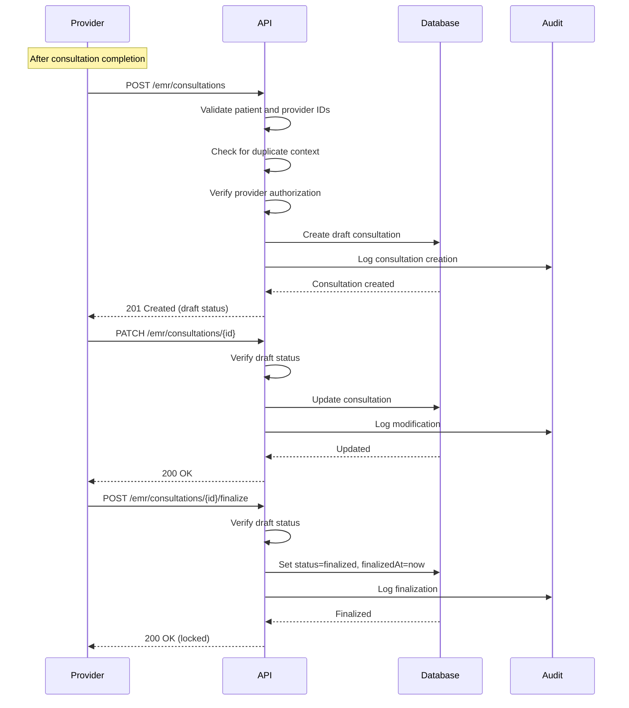
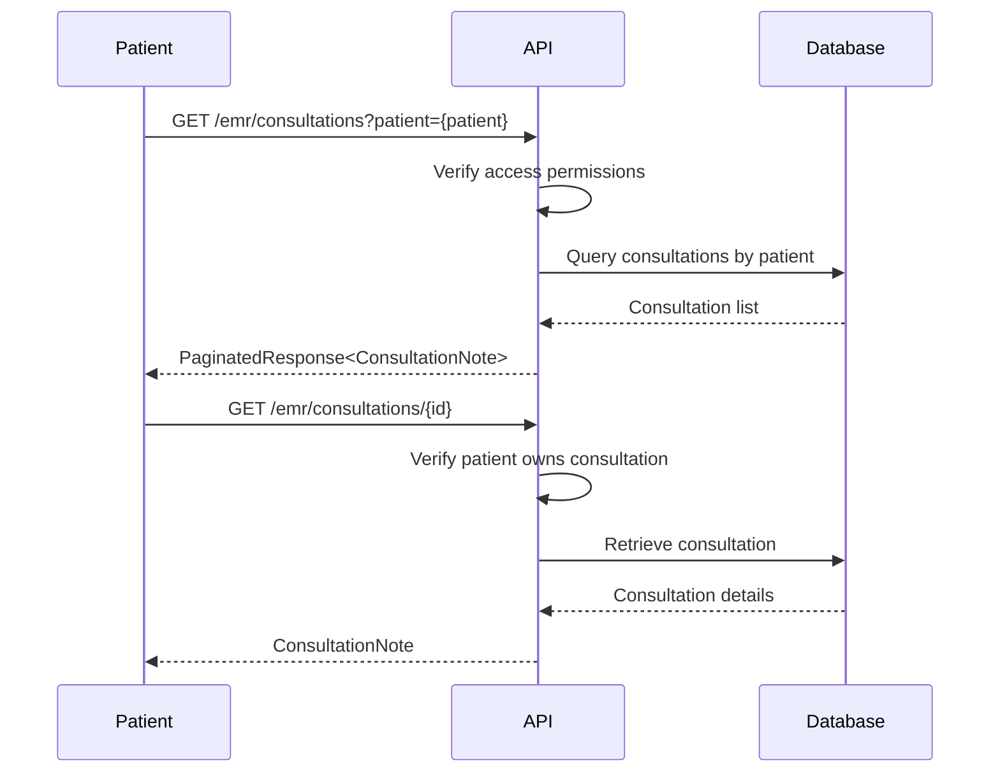

# EMR Module

## Overview

The EMR (Electronic Medical Records) module serves as the core documentation system for minor ailment consultations within the Monobase Healthcare Platform. This module manages consultation documentation, prescriptions, and patient health summaries while maintaining HIPAA compliance and audit requirements.

The module provides a streamlined, flexible documentation system optimized for rapid telemedicine consultations focusing on minor ailments, with extensibility for future integration with advanced documentation tools.

### Core Responsibilities

The EMR module:
- Captures essential consultation documentation (chief complaint, assessment, plan)
- Stores prescription information within consultation context
- Maintains consultation history for patients
- Provides health summaries for patient review
- Supports future integration with external documentation systems (e.g., Mapflow)

### Module Relationships

The EMR module integrates with:
- Patient Module: Associates documentation with patient records
- Provider Module: Tracks provider authorship of medical documentation
- Audit Module: Logs all medical record access and modifications

## Core Concepts

### Single Entity Architecture
The system uses a simplified data model:
- One primary entity (ConsultationNote) instead of multiple complex models
- JSONB fields for flexible, evolving data structures
- Context-based linkage for idempotency and flexible integration
- Minimal required fields with optional extensibility

### Documentation Minimalism
The module optimizes for speed and simplicity:
- Only three required fields: patient, provider, status
- Flexible JSONB storage for variable clinical data
- No separate entities for prescriptions or vitals
- All medical records exist within consultation context

### Future Integration Readiness
The system supports extensibility:
- External documentation field for third-party integrations
- JSONB structure allows schema-less data evolution
- Preserves simplicity while enabling complex future workflows
- Mapflow and similar tools can populate additional fields

### Context-Based Integration
The module uses context field for flexible linking:
- Support various consultation types (appointments, walk-ins, scheduled)
- Idempotency through unique context validation
- No hard dependencies on other modules
- Easy integration with different workflows

### Compliance by Design
The module maintains healthcare compliance:
- Consultation finalization workflow prevents tampering
- Audit trail through status tracking and timestamps
- Role-based access control for all operations
- Patient data isolation through ownership validation

## Data Models

```typescript
/**
 * ConsultationNote - Primary documentation entity for medical consultations
 * Uses context field for idempotency and flexible integration
 */
interface ConsultationNote {
  // Base Fields (inherited from BaseEntity)
  id: string;              // UUID, system-generated
  createdAt: Date;         // Automatic timestamp
  updatedAt: Date;         // Last modification timestamp
  
  // Relationship Fields
  patient: string;         // Required, links to patients.id
  provider: string;        // Required, links to providers.id
  context?: string;        // Optional, for idempotency (e.g., 'appointment:123', 'walkin:456')
  
  // Core Documentation Fields
  chiefComplaint?: string;  // Optional, max 500 characters
  assessment?: string;      // Optional, max 2000 characters
  plan?: string;           // Optional, max 2000 characters
  
  // Flexible Clinical Data (JSONB)
  vitals?: {
    temperature?: string;
    bloodPressure?: string;
    pulse?: number;
    weight?: string;
    height?: string;
    [key: string]: any;    // Extensible for additional vitals
  };
  
  symptoms?: {
    onset?: string;
    duration?: string;
    severity?: string;
    associated?: string[];
    denies?: string[];
    [key: string]: any;    // Extensible for symptom details
  };
  
  prescriptions?: Array<{
    id?: string;           // Optional prescription ID
    medication: string;    // Required within array
    dosage?: string;
    frequency?: string;
    duration?: string;
    instructions?: string;
    [key: string]: any;    // Extensible for additional fields
  }>;
  
  followUp?: {
    needed: boolean;
    timeframe?: string;
    instructions?: string;
    [key: string]: any;    // Extensible for follow-up details
  };
  
  // Integration Support
  externalDocumentation?: Record<string, any>; // For Mapflow, etc.
  
  // Workflow Fields
  status: ConsultationStatus;  // draft | finalized | amended
  finalizedAt?: Date;          // Timestamp when finalized
  finalizedBy?: string;        // Provider who finalized the consultation
}

/**
 * ConsultationStatus - Workflow states for consultation documentation
 */
enum ConsultationStatus {
  DRAFT = "draft",           // Being edited by provider
  FINALIZED = "finalized",   // Locked, no further edits
  AMENDED = "amended"        // Modified after finalization
}

/**
 * PatientHealthSummary - Simplified view of patient's health history
 */
interface PatientHealthSummary {
  patient: string;
  recentConsultations: number;        // Count of recent consultations
  lastConsultation?: Date;            // Date of most recent consultation
  activePrescriptions?: Array<{       // Current medications
    medication: string;
    prescribedDate: Date;
    consultation: string;             // Reference to consultation
  }>;
}
```

### Request/Response Models

```typescript
/**
 * CreateConsultationRequest - Request to create new consultation
 */
interface CreateConsultationRequest {
  patient: string;            // Required, must be valid patient UUID
  provider: string;           // Required, must be valid provider UUID
  context?: string;           // Optional, for idempotency (e.g., 'appointment:123')
  chiefComplaint?: string;    // Optional, 1-500 characters
  assessment?: string;        // Optional, 1-2000 characters
  plan?: string;              // Optional, 1-2000 characters
  
  // Optional clinical data
  vitals?: Record<string, any>;
  symptoms?: Record<string, any>;
  prescriptions?: Array<Record<string, any>>;
  followUp?: Record<string, any>;
}

/**
 * UpdateConsultationRequest - Request to update draft consultation
 */
interface UpdateConsultationRequest {
  // All fields optional for partial updates
  chiefComplaint?: string | null;   // Max 500 characters, null to clear
  assessment?: string | null;        // Max 2000 characters, null to clear
  plan?: string | null;             // Max 2000 characters, null to clear
  vitals?: Record<string, any> | null;
  symptoms?: Record<string, any> | null;
  prescriptions?: Array<Record<string, any>> | null;
  followUp?: Record<string, any> | null;
  externalDocumentation?: Record<string, any> | null;
}
```

## API Documentation

### Create Consultation
`POST /emr/consultations`

Creates new draft consultation documentation.

**Authentication**: Required (Bearer token)
**Required Role**: `provider`

**Request Body**:
```typescript
{
  patient: string;            // Required, valid patient UUID
  provider: string;           // Required, valid provider UUID
  context?: string;           // Optional, for idempotency (e.g., 'appointment:123')
  chiefComplaint?: string;    // Optional, patient's primary concern
  assessment?: string;        // Optional, clinical assessment
  plan?: string;              // Optional, treatment plan
  // Optional fields as defined in CreateConsultationRequest
}
```

**Response**: `201 Created` (ApiCreatedResponse<ConsultationNote>)

**Notes**:
- Provider must have appropriate permissions
- Context field prevents duplicate consultations for same encounter
- Context examples: 'appointment:123', 'walkin:456', 'scheduled:789'

### Get Consultation
`GET /emr/consultations/{id}`

Retrieves consultation details.

**Authentication**: Required
**Required Roles**: `admin`, `provider:owner`, or `patient:owner`

**Response**: `200 OK` (ApiOkResponse<ConsultationNote>)

**Notes**: Access based on role and ownership

### Update Consultation
`PATCH /emr/consultations/{id}`

Updates draft consultation before finalization.

**Authentication**: Required
**Required Role**: `provider:owner`

**Request Body**: UpdateConsultationRequest (all fields optional)

**Response**: `200 OK` (ApiOkResponse<ConsultationNote>)

**Notes**:
- Only draft consultations can be updated
- Only the creating provider can update

### Finalize Consultation
`POST /emr/consultations/{id}/finalize`

Locks consultation from further edits.

**Authentication**: Required
**Required Role**: `provider:owner`

**Response**: `200 OK` (ApiOkResponse<ConsultationNote>)

**Notes**:
- Consultation must be in draft status
- Sets status to finalized and records timestamp
- Cannot be reversed (amendment creates new version)

### List Consultations
`GET /emr/consultations`

Retrieves consultations with optional filtering.

**Authentication**: Required
**Required Roles**: `provider`, `admin`, or `patient`

**Query Parameters**:
- `patient`: Filter by patient UUID
- `status`: Filter by consultation status (draft, finalized, amended)
- `limit`: Items per page (default: 20, max: 100)
- `offset`: Number of items to skip

**Response**: `200 OK` (ApiOkResponse<PaginatedResponse<ConsultationNote>>)

**Notes**: Use patient query parameter to get a specific patient's consultations

### List EMR Patients
`GET /emr/patients`

Retrieves list of patients with EMR records.

**Authentication**: Required
**Required Roles**: `provider` or `admin`

**Query Parameters**:
- `expand`: Expand related resources (e.g., 'person')
- `limit`: Items per page (default: 20, max: 100)
- `offset`: Number of items to skip

**Response**: `200 OK` (ApiOkResponse<PaginatedResponse<Patient>>)

**Notes**: Returns patients who have consultation records

## Workflows

### Consultation Documentation Workflow



### Patient Access Workflow



## Security Considerations

### Role-Based Access Control

The system enforces these access controls:

| Operation | Required Roles | Description |
|-----------|---------------|-------------|
| Create Consultation | `provider` | Only providers can create consultations |
| View Consultation | `admin`, `provider:owner`, `patient:owner` | Multi-role access based on ownership |
| Update Consultation | `provider:owner` | Only creating provider can update drafts |
| Finalize Consultation | `provider:owner` | Only creating provider can finalize |
| List Patient Consultations | `admin`, `provider`, `patient` | Role-based filtering |

### Audit Logging

All operations must be logged with:
- User ID and role
- Operation type (create, read, update, finalize)
- Resource ID (consultation or patient)
- Timestamp
- IP address
- Success/failure status
- Any data modifications (for updates)

### HIPAA Compliance

The module must maintain HIPAA compliance through:
- Access Control: Role-based permissions with ownership validation
- Audit Trail: Complete logging of all PHI access
- Data Integrity: Finalization workflow prevents unauthorized modifications
- Minimum Necessary: Patients see summaries, not full clinical notes
- Encryption: All PHI must be encrypted at rest and in transit

### Data Protection

The system implements:
- Field-level encryption for sensitive clinical data
- Automatic data retention policies
- Secure deletion procedures for amendments
- Access logging with tamper detection
- Regular compliance audits

## Implementation Notes

### Module Integration

#### Context-Based Integration
The EMR module:
- Uses context field for flexible integration with other modules
- Supports appointment-based consultations via context (e.g., 'appointment:123')
- Enables walk-in consultations via context (e.g., 'walkin:456')
- Prevents duplicate consultations through unique context validation
- Allows multiple integration patterns without tight coupling

#### Patient Module Integration
The module:
- Validates patient existence
- Maintains referential integrity
- Supports patient data aggregation
- Enables patient portal access

#### Provider Module Integration
The system:
- Verifies provider credentials
- Tracks consultation authorship
- Supports provider workflow integration
- Maintains provider-patient relationships

#### Future Mapflow Integration
The module supports:
- External documentation field for Mapflow data
- Parallel storage of simple and complex documentation
- API endpoints for external system callbacks
- Webhook support for async documentation updates

### Error Handling

#### Validation Errors (400)
- Missing required fields
- Field length violations
- Invalid patient or provider references
- Malformed JSONB data

#### Authorization Errors (403)
- Insufficient role permissions
- Ownership validation failures
- Attempting to modify finalized consultations
- Cross-patient access attempts

#### Not Found Errors (404)
- Non-existent consultation IDs
- Invalid patient references
- Deleted or archived records

#### Conflict Errors (409)
- Duplicate context values (prevents duplicate consultations)
- Status transition violations
- Concurrent modification attempts
- Data integrity conflicts

### Development Patterns

1. **JSONB Field Usage**:
   - Use for variable, optional data
   - Validate structure on write, be permissive on read
   - Support partial updates without data loss
   - Plan for schema evolution

2. **Status Management**:
   - Enforce one-way transitions (draft → finalized)
   - Use database constraints for status integrity
   - Include timestamp for all status changes
   - Prevent backdating of finalizations

3. **Ownership Validation**:
   - Check ownership in middleware, not handlers
   - Cache ownership for request duration
   - Support both patient and provider ownership
   - Log all ownership checks

### Performance Considerations

The implementation should:
- Index context, patient, provider fields
- Create unique constraint on context field for idempotency
- Use partial indexes for status-based queries
- Implement pagination for all list operations
- Cache patient summaries with short TTL
- Optimize JSONB queries with GIN indexes

### Testing Requirements

Test coverage should include:
- Unit tests for all CRUD operations
- Integration tests for context validation and idempotency
- Security tests for role-based access
- Performance tests for large JSONB fields
- Compliance tests for audit logging
- Tests for duplicate context prevention

### Design Rationale

#### Single Entity Approach
The decision to use a single ConsultationNote entity provides:
- Simplicity: One model is easier to understand and maintain
- Performance: Fewer joins and simpler queries
- Flexibility: JSONB allows evolution without migrations
- Context: All medical data linked to consultation context

#### JSONB for Clinical Data
Using JSONB fields enables:
- Flexibility: Add new fields without schema changes
- Integration: External systems can add custom data
- Evolution: Support future requirements without breaking changes
- Simplicity: Avoid complex relational structures

#### Context-Based Linkage
Using context field provides:
- Flexibility: Support various consultation types (appointments, walk-ins, scheduled)
- Idempotency: Prevent duplicate consultations for the same encounter
- Loose Coupling: No hard dependency on other modules
- Integration: Easy to integrate with different workflows
- Extensibility: New consultation types without schema changes

#### Minimal Required Fields
Requiring only patient, provider, and status achieves:
- Speed: Providers can document quickly
- Flexibility: Optional fields for complex cases
- Adoption: Lower barrier to entry
- Completeness: Core information always captured

### Future Considerations

#### Planned Enhancements
The module may evolve to support:
- Template system for common conditions
- Voice-to-text documentation
- AI-assisted assessment suggestions
- Integration with external EMR systems
- Advanced analytics and reporting

#### Mapflow Integration Path
When integrating Mapflow, the system should:
1. Store Mapflow data in externalDocumentation field
2. Maintain simple fields for basic viewing
3. Provide Mapflow-specific endpoints if needed
4. Support webhook callbacks for async updates
5. Implement data synchronization strategies

### Scalability Considerations
As the system grows, consider:
- Partitioning consultations by date
- Archiving old consultations to cold storage
- Implementing read replicas for patient access
- Caching layer for frequently accessed summaries
- Async processing for complex aggregations
