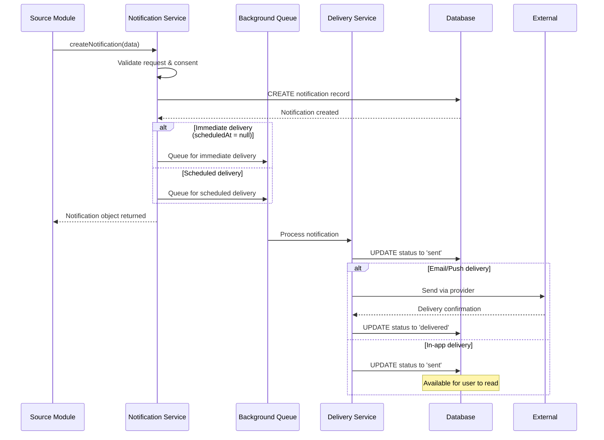
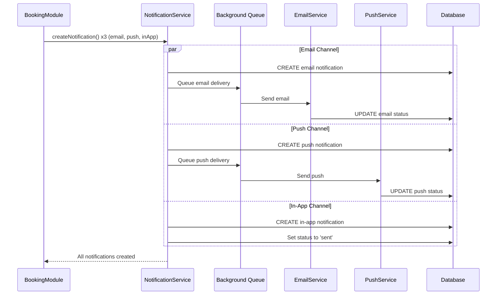
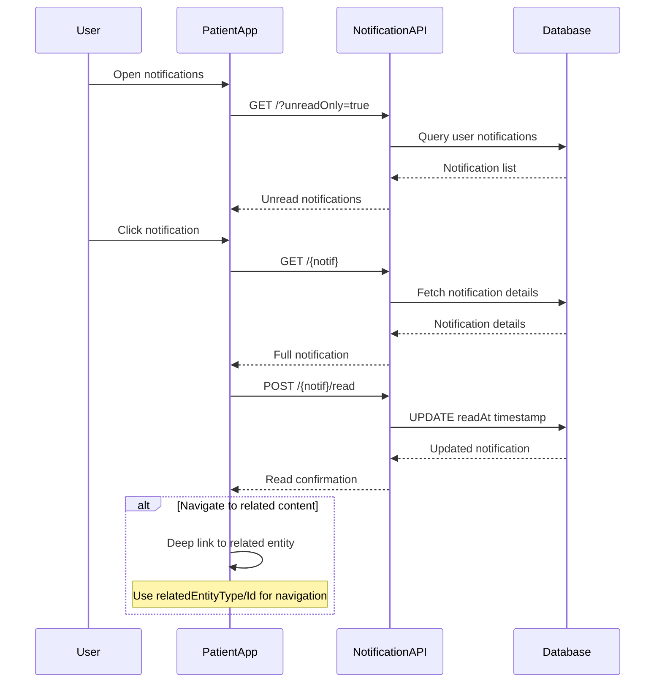
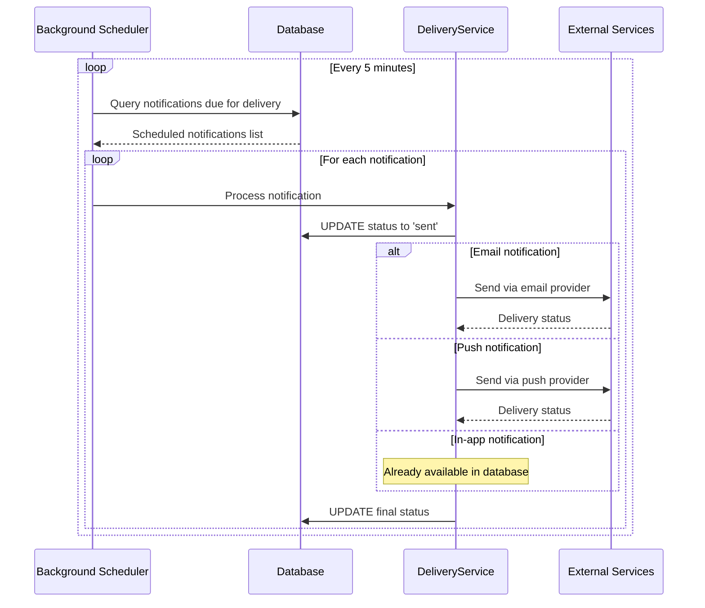

# Notification Module

## Overview

The Notification module serves as the core messaging system for all user communications within the Monobase Application Platform. This module manages multi-channel notification delivery including in-app notifications, push notifications, and email while maintaining integration with compliance requirements.

The module provides a simplified, reliable notification system that enables seamless communication between the platform and users while ensuring compliance and audit trail requirements for operations.

## Core Concepts

### Simplified Multi-Channel Architecture
The system uses the following architectural patterns:
- Each notification record represents a single message for a single delivery channel
- Multi-channel delivery requires multiple notification records for the same message
- This ensures clear status tracking and independent delivery monitoring per channel
- The system supports email, push, and in-app notification channels

### Security and Compliance Focus
The design prioritizes security and compliance requirements:
- All notifications containing sensitive information validate user consent
- The system maintains complete audit trails for compliance reporting
- Notification content is classified and handled according to data protection requirements
- User privacy controls are integrated with Person module consent management

### Operational Simplicity
The module implements:
- No complex preference system initially (keep it simple and functional)
- Straightforward data model with clear status tracking
- Simple integration patterns for other modules to trigger notifications
- Efficient background processing for scheduled notifications

## Data Models

### Notification Entity
The Notification entity includes the following fields:

```typescript
interface Notification {
  // Base Entity Fields (Required)
  id: string;              // UUID, system-generated
  createdAt: Date;         // Automatic timestamp
  updatedAt: Date;         // Automatic timestamp
  deletedAt?: Date;        // For soft deletion
  version: number;         // Optimistic locking
  createdBy: string;       // Audit trail
  updatedBy: string;       // Audit trail

  // Core Notification Data (Required)
  recipient: UUID;         // Person ID (links to Person module)
  type: NotificationType;  // Notification category
  channel: NotificationChannel; // Delivery method
  title: string;           // Notification title (max 200 chars)
  message: string;         // Notification content (max 1000 chars)

  // Scheduling & Context (Optional)
  scheduledAt?: Date;      // When to send (null = immediate)
  relatedEntityType?: string; // Source module/entity type
  relatedEntityId?: UUID;  // ID of the related record

  // Status Tracking (Required)
  status: NotificationStatus; // Current delivery status
  sentAt?: Date;           // When notification was sent
  readAt?: Date;           // When user read notification (in-app only)

  // Compliance (Required)
  consentValidated: boolean; // User consent check completed
}
```

### NotificationType Enumeration Specification
```typescript
enum NotificationType {
  appointmentReminder = "appointment-reminder",
  billing = "billing",
  security = "security", 
  system = "system"
}
```

### NotificationChannel Enumeration Specification
```typescript
enum NotificationChannel {
  email = "email",         // Email delivery
  push = "push",           // Push notification via mobile/web
  inApp = "in-app"         // In-app notification center
}
```

### NotificationStatus Enumeration Specification
```typescript
enum NotificationStatus {
  queued = "queued",       // Created, waiting to be sent
  sent = "sent",           // Successfully sent to delivery service
  delivered = "delivered", // Confirmed delivery (email/push only)
  read = "read",           // User has read notification (in-app only)
  failed = "failed",       // Delivery failed
  expired = "expired"      // Scheduled notification expired
}
```

## API Specification Requirements

### List User Notifications Endpoint
**Specification**: `GET /notifications`
- **Security Requirements**: Bearer token authentication, user role
- **Purpose**: Retrieve user's notifications with filtering and pagination
- **Access Control**: Users **can only** access their own notifications

**Query Parameters**:
- `type`: Filter by NotificationType
- `channel`: Filter by NotificationChannel  
- `status`: Filter by NotificationStatus
- `unreadOnly`: Boolean, show only unread notifications
- `startDate`: Filter notifications after date
- `endDate`: Filter notifications before date
- Standard pagination parameters (limit, offset)

**Response Requirements**: `200 OK` with paginated Notification list

### Get Notification Endpoint
**Specification**: `GET /notifications/{notification}`
- **Security Requirements**: Bearer token authentication, user role
- **Purpose**: Retrieve single notification
- **Access Control**: Users **can only** access their own notifications

**Response Requirements**: `200 OK` with Notification object

### Mark Notification as Read Endpoint
**Specification**: `PATCH /notifications/{notification}/read`
- **Security Requirements**: Bearer token authentication, user role
- **Purpose**: Mark a notification as read
- **Constraints**: Sets `readAt` timestamp and updates status to 'read'

**Response Requirements**: `200 OK` with updated Notification object

### Mark All Notifications as Read Endpoint
**Specification**: `PATCH /notifications/read-all`
- **Security Requirements**: Bearer token authentication, user role
- **Purpose**: Mark all user's notifications as read
- **Query Parameters**:
  - `type`: Optional, limit to specific notification type

**Response**: `200 OK` (ApiOkResponse<{count: number}>)


## Workflow Specifications

### 1. System Notification Creation Workflow

The system **shall implement** notification creation from other modules:



### 2. Multi-Channel Notification Workflow

The system **shall handle** sending the same message across multiple channels:



### 3. User Notification Consumption Workflow

The system **shall enable** users to read and manage their notifications:



### 4. Scheduled Notification Processing Workflow

The system **shall process** scheduled notifications efficiently:



## Security and Compliance Requirements

### Role-Based Access Control Specification
The system **must enforce** these access controls:
- **Create Operations**: System roles and service accounts only
- **Read Operations**: Users can only access their own notifications
- **Update Operations**: Users can only mark their own notifications as read
- **Delete Operations**: Users can only soft-delete their own notifications
- **Administrative Operations**: Admin role can access any notifications for support

### Data Security Compliance Requirements
The implementation **must ensure**:
- **Consent Validation**: All sensitive notifications require validated consent
- **Audit Trails**: Complete logging of all notification operations
- **Data Protection**: Notification content encrypted at rest and in transit
- **Access Control**: Strict user isolation and role-based permissions
- **Retention Policy**: Automatic cleanup of old notifications per compliance requirements

### Sensitive Data Classification
The system **shall implement**:
- **Content Classification**: Automatic classification of sensitive content
- **Consent Integration**: Check Person module consent fields before delivery
- **Secure Channels**: End-to-end encryption for sensitive notifications
- **Audit Logging**: All access and delivery attempts logged with correlation IDs

## Integration Specifications

### Booking Module Integration
The Notification module **must integrate** with the Booking module through:
```typescript
// Appointment reminder creation via internal service call
const appointment = await BookingModule.createAppointment(appointmentData);

// Internal service call to create notifications
await NotificationService.createNotification({
  recipient: patient.person,
  type: "appointment-reminder",
  channel: "push",
  title: "Appointment Reminder",
  message: `You have an appointment with ${provider.name} tomorrow at ${time}`,
  scheduledAt: appointmentDate - 24_hours,
  relatedEntityType: "appointment",
  relatedEntityId: appointment.id
});
```

### Billing Module Integration
Integration **shall enable** payment and invoice notifications:
```typescript
// Billing notification creation via internal service call
const invoice = await BillingModule.generateInvoice(invoiceData);

// Internal service call to create notification
await NotificationService.createNotification({
  recipient: patient.person,
  type: "billing", 
  channel: "email",
  title: "Invoice Available",
  message: `Your invoice for ${invoice.amount} is now available`,
  scheduledAt: null, // immediate
  relatedEntityType: "invoice",
  relatedEntityId: invoice.id
});
```

### Person Module Integration
The Notification module **must integrate** with Person consent management:
```sql
-- Consent validation query
SELECT medical_records_consent, communication_consent 
FROM person 
WHERE id = notification.recipient
AND medical_records_consent.granted = true
AND communication_consent.granted = true;
```

### Security Module Integration
Security events **shall trigger** immediate notifications:
```typescript
// Security alert creation via internal service call
const securityEvent = await SecurityModule.detectSuspiciousActivity(eventData);

// Internal service call to create notification
await NotificationService.createNotification({
  recipient: user.person,
  type: "security",
  channel: "email",
  title: "Security Alert", 
  message: "Suspicious login attempt detected",
  scheduledAt: null, // immediate
  relatedEntityType: "security-event",
  relatedEntityId: securityEvent.id,
  consentValidated: true // security notifications bypass consent
});
```

## Error Handling Specifications

### Required Error Response Patterns
The system **must return** appropriate HTTP status codes:
- `400 Bad Request`: Invalid query parameters or request format
- `401 Unauthorized`: Missing or invalid authentication token
- `403 Forbidden`: Insufficient permissions, accessing other user's notifications
- `404 Not Found`: Notification not found or user has no access
- `429 Too Many Requests`: Rate limiting exceeded for API calls
- `500 Internal Server Error`: System failure or database unavailable

### API Validation Requirements
The system **must validate** API requests:
- **Query Parameters**: Valid filter values and pagination parameters
- **Notification ID**: Must be valid UUID format in path parameters
- **Authentication**: Valid bearer token for all endpoints
- **Authorization**: User can only access their own notifications

### Business Rule Enforcement
The implementation **shall enforce**:
- Users can only access their own notifications via API
- Read operations update notification status appropriately
- Rate limiting prevents API abuse
- Automatic archival maintains system performance

## Operational Management

### Data Archiving Strategy
The system **shall implement** efficient data lifecycle management:

**Retention Policy**:
- Active notifications: 90 days from creation
- Read notifications: 30 days from read date
- Undelivered notifications: 7 days retry period, then expire

**Cleanup Process**:
```typescript
// Daily cleanup job
interface CleanupJob {
  removeExpiredNotifications(): Promise<number>; // > 90 days old
  archiveReadNotifications(): Promise<number>;   // > 30 days since read
  purgeFailedNotifications(): Promise<number>;   // > 7 days failed
}
```

### Scaling Considerations
The module **must handle** growth efficiently:

**Queue Management**:
- Background job processing for all delivery channels
- Separate queues for immediate vs scheduled notifications
- Dead letter queue for failed deliveries with retry logic

**Rate Limiting**:
```typescript
// Rate limiting specifications
interface RateLimits {
  perUser: "100 notifications per hour";
  perType: "10 appointment reminders per day per user";
  systemWide: "10000 notifications per minute";
}
```

**Performance Optimization**:
- Database indexes on recipient, status, and scheduledAt
- Batch processing for scheduled notifications
- Connection pooling for external delivery services

### Storage Management
The system **shall monitor** and control data growth:

**Growth Monitoring**:
- Daily reports on notification volume by type and channel
- Storage usage tracking with automated alerts
- Performance metrics for delivery success rates

**User Data Management**:
```typescript
// Automated user data cleanup
interface UserDataCleanup {
  archiveUserNotifications(personId: UUID): Promise<void>; // GDPR compliance
  hardDeleteUserData(personId: UUID): Promise<void>; // Complete removal on request
}
```

### GDPR and Privacy Compliance
The implementation **must support** privacy regulations:

**Right to be Forgotten**:
- Complete notification history deletion on user request
- Audit log entries for compliance reporting
- Secure deletion of all related data

**Data Minimization**:
- Store only essential notification data
- Automatic cleanup of old notifications
- No unnecessary personal information retention

## Use Cases and Examples

### Appointment Reminder Use Case
**Scenario**: Patient books appointment, system sends reminder 24 hours before

```typescript
// Booking module creates appointment
const appointment = await BookingModule.createAppointment({
  patient: patientId,
  provider: providerId, 
  scheduledAt: "2024-01-20T14:00:00Z"
});

// System creates scheduled notifications
await Promise.all([
  // Push notification for immediate awareness
  NotificationModule.createNotification({
    recipient: patient.person,
    type: "appointment-reminder",
    channel: "push", 
    title: "Appointment Reminder",
    message: "You have an appointment with Dr. Smith tomorrow at 2:00 PM",
    scheduledAt: new Date("2024-01-19T14:00:00Z"), // 24 hours before
    relatedEntityType: "appointment",
    relatedEntityId: appointment.id
  }),
  
  // Email for detailed information
  NotificationModule.createNotification({
    recipient: patient.person,
    type: "appointment-reminder", 
    channel: "email",
    title: "Appointment Reminder - Dr. Smith",
    message: "Reminder: You have an appointment tomorrow at 2:00 PM at Main Clinic...",
    scheduledAt: new Date("2024-01-19T14:00:00Z"),
    relatedEntityType: "appointment", 
    relatedEntityId: appointment.id
  }),
  
  // In-app for persistent reference
  NotificationModule.createNotification({
    recipient: patient.person,
    type: "appointment-reminder",
    channel: "inApp",
    title: "Upcoming Appointment", 
    message: "Dr. Smith - Tomorrow at 2:00 PM",
    scheduledAt: new Date("2024-01-19T14:00:00Z"),
    relatedEntityType: "appointment",
    relatedEntityId: appointment.id  
  })
]);
```

### Billing Notification Use Case
**Scenario**: Invoice generated, patient receives payment due notification

```typescript
// Billing module generates invoice
const invoice = await BillingModule.generateInvoice({
  patient: patientId,
  amount: 150.00,
  dueDate: "2024-02-01T00:00:00Z"
});

// Create immediate notification
await NotificationModule.createNotification({
  recipient: patient.person,
  type: "billing",
  channel: "email",
  title: "Invoice Available",
  message: `Your invoice for $${invoice.amount} is ready. Due date: ${invoice.dueDate}`,
  scheduledAt: null, // immediate
  relatedEntityType: "invoice",
  relatedEntityId: invoice.id,
  consentValidated: true // billing notifications require consent
});

// Create payment reminder for 3 days before due date
await NotificationModule.createNotification({
  recipient: patient.person, 
  type: "billing",
  channel: "push",
  title: "Payment Reminder", 
  message: "Your payment of $150.00 is due in 3 days",
  scheduledAt: new Date("2024-01-29T09:00:00Z"), // 3 days before due
  relatedEntityType: "invoice",
  relatedEntityId: invoice.id
});
```

### Security Alert Use Case
**Scenario**: Suspicious login detected, immediate security notification

```typescript
// Security module detects suspicious activity
const securityEvent = await SecurityModule.detectSuspiciousLogin({
  userId: userId,
  ipAddress: "192.168.1.100",
  location: "New York, NY"
});

// Create immediate security notification
await NotificationModule.createNotification({
  recipient: user.person,
  type: "security", 
  channel: "email",
  title: "Security Alert - Suspicious Login",
  message: "A login attempt was made from New York, NY. If this wasn't you, please secure your account.",
  scheduledAt: null, // immediate
  relatedEntityType: "security-event",
  relatedEntityId: securityEvent.id,
  consentValidated: true // security notifications bypass normal consent
});
```

### System Announcement Use Case
**Scenario**: Platform maintenance scheduled, notify all users

```typescript
// System creates maintenance notification for all active users
const activeUsers = await PersonModule.getActiveUsers();

for (const user of activeUsers) {
  await NotificationModule.createNotification({
    recipient: user.id,
    type: "system",
    channel: "inApp", 
    title: "Scheduled Maintenance",
    message: "The platform will be unavailable on Jan 25, 2:00-4:00 AM for maintenance.",
    scheduledAt: new Date("2024-01-24T18:00:00Z"), // Day before maintenance
    relatedEntityType: "maintenance-window",
    relatedEntityId: "maint-2024-01-25"
  });
}
```

## Implementation Guidelines

### Notification Service Pattern
Developers **should implement** the notification service using this pattern:

```typescript
// Internal notification service for modules to use
class NotificationService {
  static async createNotification(request: CreateNotificationRequest): Promise<Notification> {
    // Validate recipient exists
    const recipient = await PersonRepo.findOneById(request.recipient);
    if (!recipient) {
      throw new BadRequestError('Invalid recipient');
    }
    
    // Validate consent for medical content
    if (this.isMedicalContent(request.type) && !request.consentValidated) {
      const consent = await PersonRepo.getConsentStatus(request.recipient);
      if (!consent.medicalRecordsConsent?.granted || !consent.communicationConsent?.granted) {
        throw new Error('Medical notifications require user consent');
      }
    }
    
    // Create notification record
    const notification = await NotificationRepo.createOne({
      recipient: request.recipient,
      type: request.type,
      channel: request.channel,
      title: request.title,
      message: request.message,
      scheduledAt: request.scheduledAt,
      relatedEntityType: request.relatedEntityType,
      relatedEntityId: request.relatedEntityId,
      status: 'queued',
      consentValidated: request.consentValidated || false,
      createdBy: 'system',
      updatedBy: 'system'
    });
    
    // Queue for delivery
    if (notification.scheduledAt && notification.scheduledAt > new Date()) {
      await NotificationQueue.scheduleDelivery(notification);
    } else {
      await NotificationQueue.queueImmediate(notification);
    }
    
    return notification;
  }
  
  private static isMedicalContent(type: NotificationType): boolean {
    return type === 'appointment-reminder'; // Add other medical types as needed
  }
}
```

### Background Processing Pattern
Implementations **must handle** delivery processing:

```typescript
// Required background job pattern
class NotificationProcessor {
  async processScheduledNotifications(): Promise<void> {
    const dueNotifications = await NotificationRepo.getScheduledNotifications({
      status: 'queued',
      scheduledBefore: new Date()
    });
    
    for (const notification of dueNotifications) {
      try {
        await this.deliverNotification(notification);
      } catch (error) {
        await this.handleDeliveryFailure(notification, error);
      }
    }
  }
  
  private async deliverNotification(notification: Notification): Promise<void> {
    // Update status to processing
    await NotificationRepo.updateOne(notification.id, { 
      status: 'sent',
      sentAt: new Date()
    });
    
    switch (notification.channel) {
      case 'email':
        await EmailService.send({
          to: await this.getRecipientEmail(notification.recipient),
          subject: notification.title,
          body: notification.message
        });
        break;
        
      case 'push':
        await PushService.send({
          userId: notification.recipient,
          title: notification.title, 
          body: notification.message,
          data: {
            notificationId: notification.id,
            relatedEntityType: notification.relatedEntityType,
            relatedEntityId: notification.relatedEntityId
          }
        });
        break;
        
      case 'inApp':
        // In-app notifications are already available in database
        // Just update status to indicate they're ready
        await NotificationRepo.updateOne(notification.id, { status: 'delivered' });
        break;
    }
  }
}
```

### User Notification Retrieval Pattern
Frontend applications **should implement** this pattern:

```typescript
// Required pattern for displaying user notifications
class NotificationService {
  async getUserNotifications(userId: string, filters: NotificationFilters = {}) {
    const response = await fetch('/api/notifs', {
      method: 'GET',
      headers: {
        'Authorization': `Bearer ${userToken}`,
        'Content-Type': 'application/json'
      },
      params: new URLSearchParams({
        ...filters,
        limit: '20',
        offset: filters.offset || '0'
      })
    });
    
    if (!response.ok) {
      throw new Error('Failed to fetch notifications');
    }
    
    return await response.json();
  }
  
  async markAsRead(notificationId: string) {
    const response = await fetch(`/api/notifs/${notificationId}/read`, {
      method: 'POST',
      headers: {
        'Authorization': `Bearer ${userToken}`,
        'Content-Type': 'application/json'
      }
    });
    
    if (!response.ok) {
      throw new Error('Failed to mark notification as read');
    }
    
    return await response.json();
  }
  
  async deleteNotification(notificationId: string) {
    const response = await fetch(`/api/notifs/${notificationId}`, {
      method: 'DELETE',
      headers: {
        'Authorization': `Bearer ${userToken}`
      }
    });
    
    if (!response.ok) {
      throw new Error('Failed to delete notification');
    }
  }
}
```

### Module Integration Pattern
Other modules **should trigger** notifications using this approach:

```typescript
// Standard pattern for modules to create notifications
class BookingModule {
  async createAppointment(appointmentData: CreateAppointmentRequest): Promise<Appointment> {
    // Create the appointment
    const appointment = await AppointmentRepo.createOne(appointmentData);
    
    // Send confirmation notification via internal service
    await NotificationService.createNotification({
      recipient: appointment.patient,
      type: 'appointment-reminder',
      channel: 'inApp',
      title: 'Appointment Confirmed',
      message: `Your appointment with ${appointment.provider.name} is confirmed for ${appointment.scheduledAt}`,
      scheduledAt: null, // immediate
      relatedEntityType: 'appointment',
      relatedEntityId: appointment.id
    });
    
    // Schedule reminder notification via internal service
    const reminderTime = new Date(appointment.scheduledAt);
    reminderTime.setHours(reminderTime.getHours() - 24); // 24 hours before
    
    await NotificationService.createNotification({
      recipient: appointment.patient,
      type: 'appointment-reminder', 
      channel: 'push',
      title: 'Appointment Reminder',
      message: `You have an appointment tomorrow at ${appointment.scheduledAt}`,
      scheduledAt: reminderTime,
      relatedEntityType: 'appointment',
      relatedEntityId: appointment.id
    });
    
    return appointment;
  }
}
```

## Performance Optimization Requirements

### Database Optimization
The system **must implement** the following optimizations:

**Required Indexes**:
```sql
-- Primary notification queries
CREATE INDEX notifications_recipient_status_idx ON notifications(recipient, status);
CREATE INDEX notifications_scheduled_status_idx ON notifications(scheduled_at, status);
CREATE INDEX notifications_type_channel_idx ON notifications(type, channel);
CREATE INDEX notifications_created_at_idx ON notifications(created_at);

-- Soft delete performance  
CREATE INDEX notifications_deleted_at_idx ON notifications(deleted_at) WHERE deleted_at IS NULL;

-- User notification retrieval
CREATE INDEX notifications_user_unread_idx ON notifications(recipient, status, created_at) 
  WHERE status IN ('sent', 'delivered') AND deleted_at IS NULL;
```

**Query Optimization**:
- Use prepared statements for frequent queries
- Implement pagination for user notification lists
- Batch process scheduled notifications
- Connection pooling for external delivery services

### Storage Optimization
The repository **shall optimize** data storage:

**Data Compression**:
- JSONB storage for relatedEntity information
- Text compression for message content
- Archive old notifications to separate tables

**Cleanup Automation**:
```typescript
// Automated cleanup specifications
interface CleanupSchedule {
  daily: "Remove notifications older than 90 days";
  weekly: "Archive read notifications older than 30 days";
  monthly: "Compact notification table and rebuild indexes";
}
```

## Monitoring and Analytics Requirements

### Required Metrics
The system **must track** operational metrics:

**Delivery Metrics**:
- Notification creation volume by type and channel
- Delivery success rates per channel
- Average delivery time by channel
- Failed delivery reasons and retry success rates

**User Engagement Metrics**:
- Read rates for in-app notifications
- Click-through rates for email notifications
- Push notification open rates
- User notification deletion patterns

**System Performance Metrics**:
- API response times by endpoint
- Background job processing times
- Queue depth and processing lag
- Database query performance

### Audit Requirements
All operations **must generate** comprehensive audit logs:

**Required Audit Fields**:
```typescript
interface NotificationAuditLog {
  timestamp: Date;
  action: 'create' | 'read' | 'delete' | 'deliver' | 'fail';
  notificationId: UUID;
  userId?: UUID;          // For user actions
  systemUser?: string;    // For system actions
  ipAddress?: string;     // For user actions
  userAgent?: string;     // For user actions
  deliveryChannel?: NotificationChannel;
  success: boolean;
  errorMessage?: string;
  processingTimeMs: number;
}
```

**Compliance Reporting**:
- Daily notification volume reports
- User consent validation logs
- Delivery failure analysis
- Security notification audit trails

## Design Rationale

The Notification module design provides a practical, healthcare-focused messaging system by:

### 1. Simplified Channel Architecture
**Decision**: Use separate records for each delivery channel rather than complex multi-channel tracking
- **Benefit**: Clear status tracking per channel, independent failure handling
- **Trade-off**: More database records, but much simpler logic and monitoring
- **Healthcare Value**: Essential for audit trails and compliance reporting

### 2. Essential Notification Types Only  
**Decision**: Support only core healthcare workflows (appointments, billing, security, system)
- **Benefit**: Focused implementation, clear use cases, easier maintenance
- **Trade-off**: Limited initial functionality, but allows focused development
- **Future Growth**: Easy to add new types as platform features expand

### 3. Consent Integration Without Complexity
**Decision**: Simple boolean flag with Person module integration rather than complex consent management
- **Benefit**: Compliance without over-engineering
- **Trade-off**: Relies on Person module for detailed consent tracking
- **Practical Value**: Essential for data protection while maintaining simplicity

### 4. No Initial Preference System
**Decision**: Skip user preference configuration in initial implementation
- **Benefit**: Faster development, simpler user experience, fewer edge cases
- **Trade-off**: Less user control initially, but can be added later
- **Practical Value**: Focus on core functionality first, iterate based on user feedback

### 5. Background Processing Architecture
**Decision**: Asynchronous processing for all delivery channels including in-app
- **Benefit**: Consistent processing model, better performance, retry capability
- **Trade-off**: Slight complexity in setup, but much better scalability
- **Operational Value**: Essential for handling scheduled notifications and delivery failures

### 6. Operational Focus on Data Lifecycle
**Decision**: Include comprehensive data archiving and cleanup specifications
- **Benefit**: Prevents database bloat, supports compliance retention requirements
- **Operational Value**: Essential for long-term platform sustainability and cost management
- **Trade-off**: Additional background job complexity, but necessary for production operation

The architecture provides a robust foundation for notification management that can scale with the platform while maintaining compliance and operational efficiency. The simplified approach enables rapid implementation while supporting future enhancements as requirements evolve.