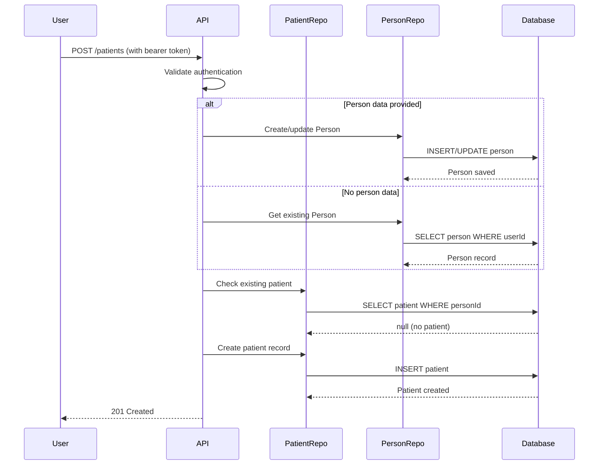
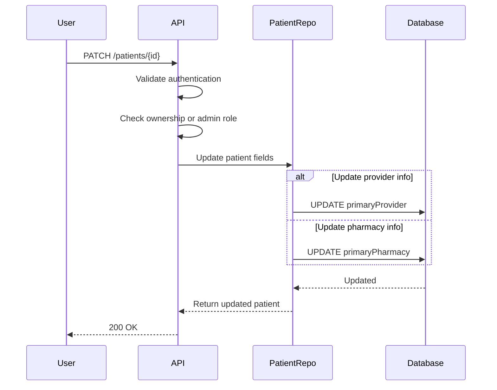
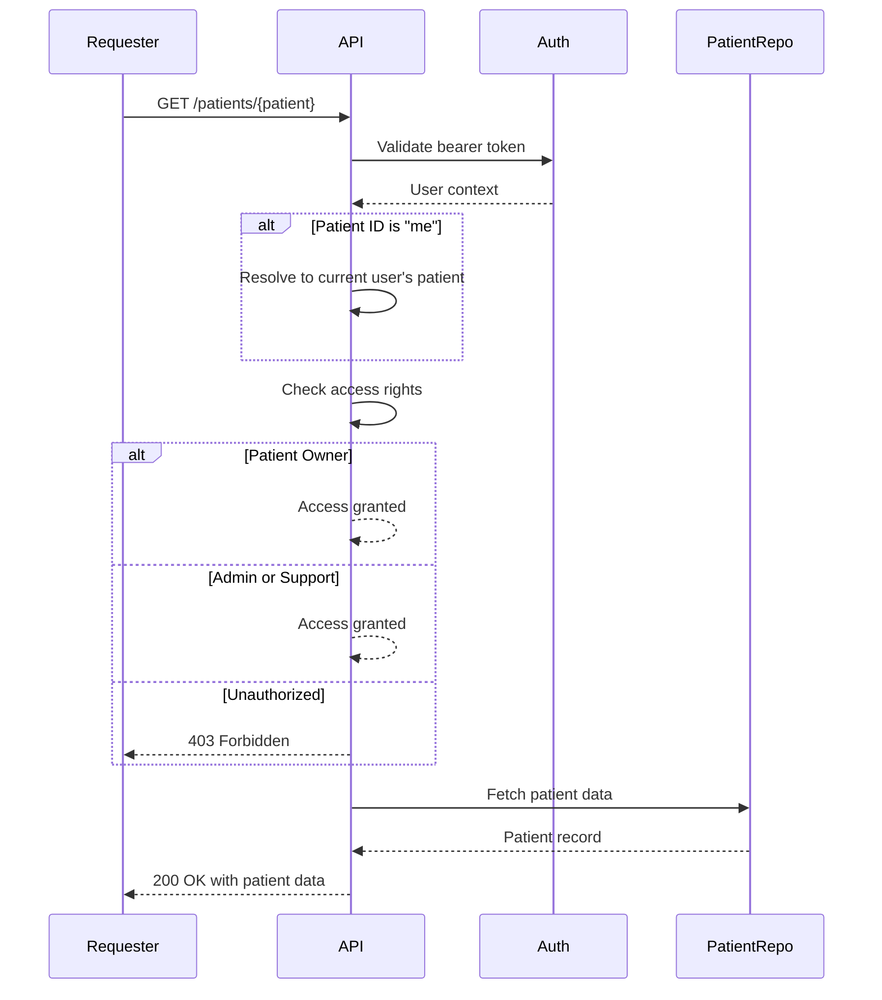

# Patient Module

## Overview

The Patient module serves as the patient profile management layer for individuals receiving medical services within the Monobase Application Platform. This module manages primary provider relationships and pharmacy preferences while maintaining integration with the Person module for demographic data.

The module acts as a streamlined patient profile system, extending the Person base model while providing essential healthcare provider and pharmacy information management for basic healthcare service coordination.

## Core Concepts

### Person Module Extension Architecture
The system enforces the following architectural patterns:
- Each Patient record has a `personId` that references a Person record
- This ensures separation between PII (in Person) and clinical data (in Patient)
- Patient creation requires an existing Person record
- A Person can have at most one Patient record (1:1 relationship)

### Healthcare Provider Relationships
The design supports basic provider associations:
- Patients can have a primary provider relationship (optional)
- Provider information is stored as a simple embedded structure
- The system allows updating provider information as needed

### Pharmacy Management  
The module provides:
- Primary pharmacy designation for prescription routing
- Basic pharmacy information storage (name, address, phone, fax)
- Simple pharmacy information updates

## Data Models

### Patient Entity
The Patient entity includes the following fields:

```typescript
interface Patient {
  // Base Entity Fields (Required)
  id: string;              // UUID, system-generated
  createdAt: Date;         // Automatic timestamp
  updatedAt: Date;         // Automatic timestamp
  version: number;         // Optimistic locking
  createdBy: string;       // Audit trail
  updatedBy: string;       // Audit trail

  // Person Association (Required)
  person: UUID | Person;   // Reference to Person record or expanded object

  // Provider Information (Optional)
  primaryProvider?: ProviderInfo;      // Primary care provider

  // Pharmacy Information (Optional)
  primaryPharmacy?: PharmacyInfo;      // Preferred pharmacy
}
```

### Supporting Types

#### ProviderInfo
```typescript
interface ProviderInfo {
  name: string;           // Provider name (required)
  specialty?: string;     // Provider specialty (optional)
  phone?: string;         // Contact phone in E.164 format
  fax?: string;          // Fax number for prescriptions
}
```

#### PharmacyInfo
```typescript
interface PharmacyInfo {
  name: string;          // Pharmacy name (required)
  address?: string;      // Pharmacy address (optional)
  phone?: string;        // Contact phone in E.164 format
  fax?: string;         // Fax number for prescriptions
}
```


## API Documentation

### Create Patient
`POST /patients`

Creates a patient record for an authenticated user.

**Authentication**: Required (Bearer token)
**Required Role**: `user`

**Request Body**:
```typescript
{
  person?: PersonCreateRequest;  // Optional person demographic info
  primaryProvider?: ProviderInfo; // Optional provider information
  primaryPharmacy?: PharmacyInfo; // Optional pharmacy information
}
```

**Response**: `201 Created` (ApiCreatedResponse<Patient>)

**Notes**:
- If person data is not provided, user should have an existing Person record
- User cannot already have a Patient record

### Get Patient
`GET /patients/{patient}`

Retrieves patient information.

**Authentication**: Required
**Required Roles**: `admin`, `support`, or `patient:owner`

**Path Parameters**:
- `patient`: UUID or 'me' for current user's profile

**Query Parameters**:
- `expand`: Include related data (e.g., `person`)

**Response**: `200 OK` (ApiOkResponse<Patient>)

**Notes**:
- Patients can only access their own records
- Admins and support can access any patient record
- Use 'me' as patient ID to get current user's profile

### Update Patient
`PATCH /patients/{patient}`

Updates patient provider and pharmacy information.

**Authentication**: Required
**Required Role**: `patient:owner`

**Request Body**:
```typescript
{
  primaryProvider?: ProviderInfo | null;
  primaryPharmacy?: PharmacyInfo | null;
}
```

**Response**: `200 OK` (ApiOkResponse<Patient>)

**Notes**:
- Only primaryProvider and primaryPharmacy can be updated
- Null values clear the respective fields

### List Patients
`GET /patients`

Lists patients with filtering and pagination.

**Authentication**: Required
**Required Roles**: `admin` or `support`

**Query Parameters**:
- `q`: General search query
- `expand`: Include related data
- Standard pagination parameters (limit, offset)

**Response**: `200 OK` (ApiOkResponse<PaginatedResponse<Patient>>)

### Delete Patient
`DELETE /patients/{patient}`

Soft deletes a patient record.

**Authentication**: Required
**Required Role**: `patient:owner`

**Response**: `204 No Content` (ApiNoContentResponse)

**Notes**:
- Only patients can delete their own records

## Workflows

### Patient Registration Flow

The system implements the following registration process:



### Patient Profile Update Flow

The system provides simple profile updates:



### Patient Data Access Control Flow

The system enforces role-based access:



## Implementation Notes

### Repository Pattern
The PatientRepository extends the base DatabaseRepository and provides patient-specific data access methods:

```typescript
class PatientRepository extends DatabaseRepository<Patient, NewPatient, PatientFilters> {
  // Required Methods:
  findByPersonId(personId: string): Promise<Patient | null>
  findByUserId(userId: string): Promise<Patient | null>
  createWithPerson(data: PatientCreateRequest, userId: string): Promise<Patient>
  updateProviderInfo(patientId: string, provider: ProviderInfo | null): Promise<Patient>
  updatePharmacyInfo(patientId: string, pharmacy: PharmacyInfo | null): Promise<Patient>
  getWithPerson(patientId: string): Promise<PatientWithPerson>
  buildWhereConditions(filters?: PatientFilters): SQL<unknown>
}
```

### Repository Features
The repository implements:
- Person Join Support: Joining with Person table for demographic data
- JSONB Field Management: Storing provider and pharmacy info as JSONB
- Unique Constraint: One patient record per person

### Query Optimization
The repository optimizes:
- Person table joins for expanded queries
- Indexed searches on person_id foreign key
- JSONB field access for provider and pharmacy data

## Security Considerations

### Role-Based Access Control
- **Create**: Requires `user` role
- **Read Own Record**: Requires `patient:owner` role via 'me' endpoint
- **Read Any Record**: Requires `admin` or `support` roles
- **Update**: Requires `patient:owner` or `admin`
- **Delete**: Requires `patient:owner` or `admin`
- **List**: Requires `admin` or `support` roles only

### HIPAA Compliance
- All patient operations must be logged with user context
- Role-based access to patient information
- Patient data protected via authentication
- Users can only access their own records unless admin/support

### Data Protection
- PII Isolation: Demographic data remains in Person module
- Simple Data Model: Minimal patient information stored
- Soft Deletes: Patient records marked as deleted, not removed
- Access Logging: All access attempts recorded

### Person Module Integration
The Patient module integrates with Person through:
```sql
-- Patient table foreign key specification
ALTER TABLE patient 
ADD CONSTRAINT fk_patient_person 
FOREIGN KEY (person_id) REFERENCES person(id)
ON DELETE CASCADE;

-- Unique constraint for one patient per person
CREATE UNIQUE INDEX patients_person_id_unique ON patient(person_id);

-- Performance index
CREATE INDEX patients_person_id_idx ON patient(person_id);
```

### Module Integration Points
The Patient module provides extension points for:
- Booking Module: Patient identification for appointments
- EMR Module: Patient context for medical records
- Billing Module: Patient identification for invoicing
- Communication Module: Patient messaging and notifications

### Error Handling
- `400 Bad Request`: Invalid input or validation failures
- `401 Unauthorized`: Missing or invalid authentication
- `403 Forbidden`: Insufficient permissions for operation
- `404 Not Found`: Patient record not found
- `409 Conflict`: Patient record already exists for user

### Validation Requirements
- **ProviderInfo**: 
  - `name`: Required, 1-100 characters
  - `specialty`: Optional, max 100 characters
  - `phone`: Optional, E.164 format when provided
  - `fax`: Optional, permissive format
- **PharmacyInfo**:
  - `name`: Required, 1-100 characters
  - `address`: Optional, max 500 characters
  - `phone`: Optional, E.164 format when provided
  - `fax`: Optional, permissive format

### Business Rules
- One patient record per person maximum
- Person record must exist or be created with patient
- Null values in updates clear the respective fields
- Soft deletes maintain data integrity

### Patient Creation Pattern
```typescript
// Required approach for patient creation
let personId: string;

if (request.person) {
  // Create or update person if data provided
  const person = await personRepo.createOrUpdate(request.person, user.id);
  personId = person.id;
} else {
  // Use existing person
  const person = await personRepo.findByUserId(user.id);
  if (!person) {
    throw new BadRequestError('Person profile required');
  }
  personId = person.id;
}

// Check for existing patient
const existingPatient = await patientRepo.findByPersonId(personId);
if (existingPatient) {
  throw new ConflictError('Patient record already exists');
}

// Create patient
const patient = await patientRepo.createOne({
  person: personId,
  primaryProvider: request.primaryProvider,
  primaryPharmacy: request.primaryPharmacy,
  createdBy: user.id,
  updatedBy: user.id
});
```

### Patient Update Pattern
```typescript
// Required update pattern
const updates: Partial<Patient> = {};

// Handle provider update
if ('primaryProvider' in request) {
  updates.primaryProvider = request.primaryProvider; // Can be null to clear
}

// Handle pharmacy update
if ('primaryPharmacy' in request) {
  updates.primaryPharmacy = request.primaryPharmacy; // Can be null to clear
}

updates.updatedBy = user.id;
updates.updatedAt = new Date();

const patient = await patientRepo.updateOne(patientId, updates);
```

### Access Control Pattern
```typescript
// Required access control for GET /patients/{patient}
if (patientId === 'me') {
  // Resolve to current user's patient
  const patient = await patientRepo.findByUserId(user.id);
  if (!patient) {
    throw new NotFoundError('No patient profile found');
  }
  return patient;
}

// Check access rights
const patient = await patientRepo.findOneById(patientId);
if (!patient) {
  throw new NotFoundError('Patient not found');
}

// Check ownership or admin access
if (patient.person !== user.personId && 
    !user.roles.includes('admin') && 
    !user.roles.includes('support')) {
  throw new ForbiddenError('Access denied');
}

return patient;
```

### Performance Optimization

#### Database Optimization
- Indexes on person_id foreign key for joins
- JSONB storage for provider and pharmacy info
- Unique constraints to prevent duplicate patient records per person

#### Query Optimization
- Person table joins when expand parameter is used
- Pagination for list operations
- Simple JSONB field updates

### Monitoring and Analytics

#### Metrics
- Patient creation success/failure rates
- Profile update frequency
- API response times by endpoint
- Access patterns (me vs direct ID)

#### Audit Requirements
All operations generate audit logs including:
- User identifier (createdBy/updatedBy)
- Patient identifier
- Action performed (create/read/update/delete)
- Timestamp
- Success/failure status

## Design Rationale

The Patient module design provides a streamlined foundation for patient profile management by:

1. **Extending Person Architecture**: Maintains clean separation between demographics (Person) and patient-specific data while preserving the relationship
2. **Simple Provider Relationships**: Basic provider information storage enables essential care coordination without complex validation
3. **Pharmacy Information Management**: Straightforward pharmacy data storage supports prescription routing needs
4. **Minimal Data Model**: Focused on essential fields reduces complexity while meeting core requirements
5. **Role-Based Access**: Clear access control patterns protect patient privacy while enabling appropriate data access
6. **Future Extensibility**: Simple base structure allows for future enhancements as requirements evolve

The architecture provides a practical starting point for patient management that can be enhanced over time with additional features such as medical history tracking, consent management, and comprehensive provider relationships as the platform grows.
