# Person Module

## Overview

The Person module serves as the central PII (Personally Identifiable Information) safeguard for the Monobase Application Platform. It manages all personal demographic and contact information while maintaining strict separation from authentication and identity management.

This module acts as the foundational data layer for all user types in the system, with Patient and Provider modules extending this base through foreign key relationships.

## Core Concepts

### User-Person Relationship
- Each Person record has an ID that directly maps to a User ID from the identity system
- Enforces a strict 1:1 relationship between authentication and personal data
- Person creation requires an authenticated user, where Person.id = User.id

### Multi-Role Architecture
- A single Person can have multiple roles: `['user', 'admin', 'support']`
- Different modules extend Person via `personId` foreign key relationships
- Allows the same individual to have multiple roles within the platform

### PII Protection
- Centralized storage and management of all personally identifiable information
- JSONB storage for complex nested data structures
- Comprehensive audit logging for all PII access and modifications

## Data Models

### Person Entity

```typescript
interface Person {
  // Base Entity Fields
  id: string;              // Maps directly to User.id
  createdAt: Date;         // Automatic timestamp
  updatedAt: Date;         // Automatic timestamp  
  deletedAt?: Date;        // For soft deletion
  version: number;         // Optimistic locking
  createdBy: string;       // Audit trail
  updatedBy: string;       // Audit trail

  // Personal Information
  firstName: string;       // Required, max 50 characters
  lastName?: string;       // Optional, max 50 characters
  middleName?: string;     // Optional, max 50 characters
  dateOfBirth?: Date;      // Optional
  gender?: Gender;         // Optional, from predefined enum

  // Complex Data Fields (JSONB)
  primaryAddress?: Address;        // Structured address data
  contactInfo?: ContactInfo;       // Email and phone information
  avatar?: MaybeStoredFile;        // Profile image reference
  languagesSpoken?: string[];      // Array of language codes
  timezone?: string;               // IANA timezone identifier
}
```

### Supporting Types

```typescript
enum Gender {
  "male" | "female" | "non-binary" | "other" | "prefer-not-to-say"
}

interface Address {
  street1: string;         // Required
  street2?: string;        // Optional
  city: string;           // Required
  state: string;          // Required
  postalCode: string;     // Required
  country: string;        // Required country code
  coordinates?: {         // Optional geolocation
    latitude: number;
    longitude: number;
    accuracy?: number;
  };
}

interface ContactInfo {
  email?: string;         // Valid email format
  phone?: string;         // Valid phone format
}

interface MaybeStoredFile {
  file?: string;          // UUID reference to stored file
  url: string;            // Direct URL to file
}
```

## API Documentation

### Create Person
`POST /persons`

Creates a new person profile for an authenticated user.

**Authentication**: Required (Bearer token)
**Required Role**: `user`

**Request Body**:
```typescript
{
  firstName: string;           // Required
  lastName?: string;           
  middleName?: string;         
  dateOfBirth?: string;        // ISO date string
  gender?: Gender;             
  primaryAddress?: Address;    
  contactInfo?: ContactInfo;   
  avatar?: MaybeStoredFile;    
  languagesSpoken?: string[];  
  timezone?: string;           // IANA timezone
}
```

**Response**: `201 Created` (ApiCreatedResponse<Person>)

### Get Person
`GET /persons/{personId}`

Retrieves a specific person's information.

**Authentication**: Required
**Required Roles**: `admin`, `support`, or `user:owner`

**Response**: `200 OK` (ApiOkResponse<Person>)

### Update Person
`PATCH /persons/{personId}`

Updates person information.

**Authentication**: Required
**Required Role**: `user:owner`

**Request Body**: Same structure as create request, all fields optional
**Response**: `200 OK` (ApiOkResponse<Person>)

### List Persons
`GET /persons`

Lists persons with optional filtering and pagination.

**Authentication**: Required
**Required Roles**: `admin` or `support`

**Query Parameters**:
- `q`: Search across firstName and lastName
- Standard pagination parameters (limit, offset)

**Response**: `200 OK` (ApiOkResponse<PaginatedResponse<Person>>)

## Security Considerations

### Role-Based Access Control
- **Create**: Requires `user` role
- **Read Own Record**: Requires `user:owner` role
- **Read Any Record**: Requires `admin` or `support` roles
- **Update**: Requires `user:owner` role (users can only modify their own data)
- **List**: Requires `admin` or `support` roles

### Data Security Compliance
- All person operations must be logged with user context
- PII must be centralized and isolated from other system components
- JSONB fields containing sensitive data require encryption at rest
- Comprehensive audit trails for all personal data access

### Data Protection
- Encryption at rest for sensitive JSONB fields
- Privacy controls for PII access
- Support for GDPR requirements
- Unified consent management

## Implementation Notes

### Person Creation Pattern
```typescript
// Person.id must use authenticated user's ID
const person = await personRepo.createOne({
  id: user.id,
  firstName: request.firstName,
  // ... other fields
  createdBy: user.id,
  updatedBy: user.id
});
```

### Authorization Pattern
```typescript
// Validate permissions before access
const user = ctx.get('user');
if (!user) throw new UnauthorizedError('Authentication required');

// Check access control
if (personId !== user.id && !hasAdminRole(user)) {
  throw new ForbiddenError('Access denied');
}
```

### Extension Pattern
Other modules extend Person through foreign key relationships:

```sql
-- Example extension table
CREATE TABLE user_profile (
  id UUID PRIMARY KEY,
  person_id UUID NOT NULL REFERENCES person(id),
  -- profile-specific fields
);
```

### Error Handling
- `400 Bad Request`: Invalid input data
- `401 Unauthorized`: Missing or invalid authentication
- `403 Forbidden`: Insufficient permissions
- `404 Not Found`: Person record not found
- `409 Conflict`: Person already exists for user

### Validation Requirements
- `firstName`: Required, 1-50 characters
- `lastName`: Optional, 1-50 characters when provided
- `dateOfBirth`: Valid date format
- `gender`: Must be from defined enum values
- Complex objects must conform to their schemas

## Workflows

### Person Registration Flow


### Multi-Role Architecture



```mermaid
graph TD
    Person --> Profile[User Profile]
    Person --> Admin[Platform Admin]

    Profile --> P1[Profile.personId → Person.id]
```

## Design Rationale

The Person module design provides a comprehensive foundation for PII management by:

1. **Centralizing PII Management**: All personal data flows through a single, secure module
2. **Supporting Multi-Role Users**: Users can have multiple roles within the platform
3. **Ensuring Compliance**: Built-in audit trails and access controls support regulatory requirements
4. **Providing Flexibility**: JSONB fields allow for complex data structures
5. **Maintaining Security**: Role-based access and encryption protect sensitive data