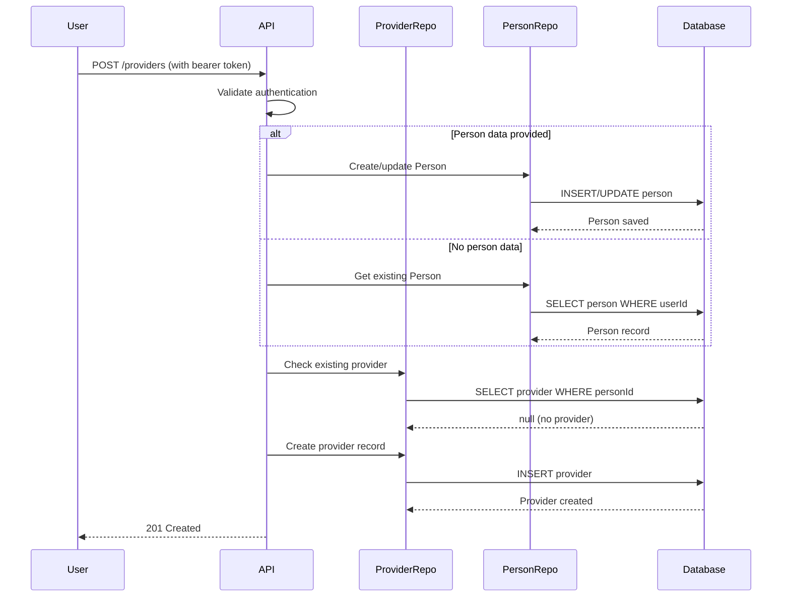
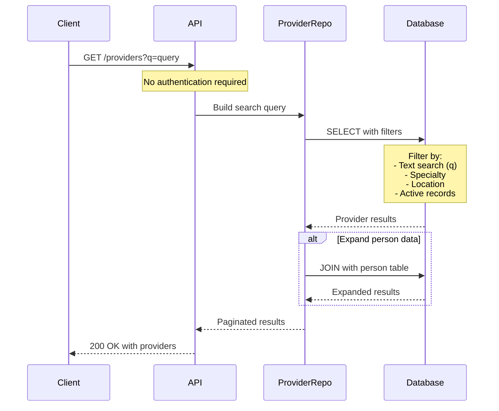
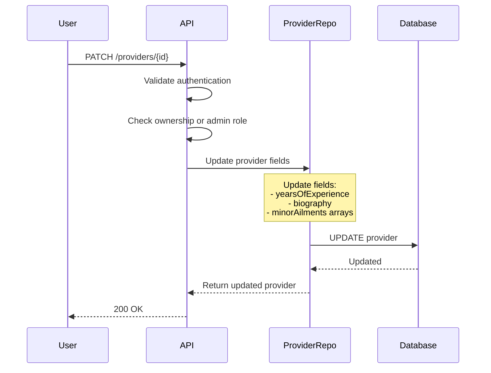
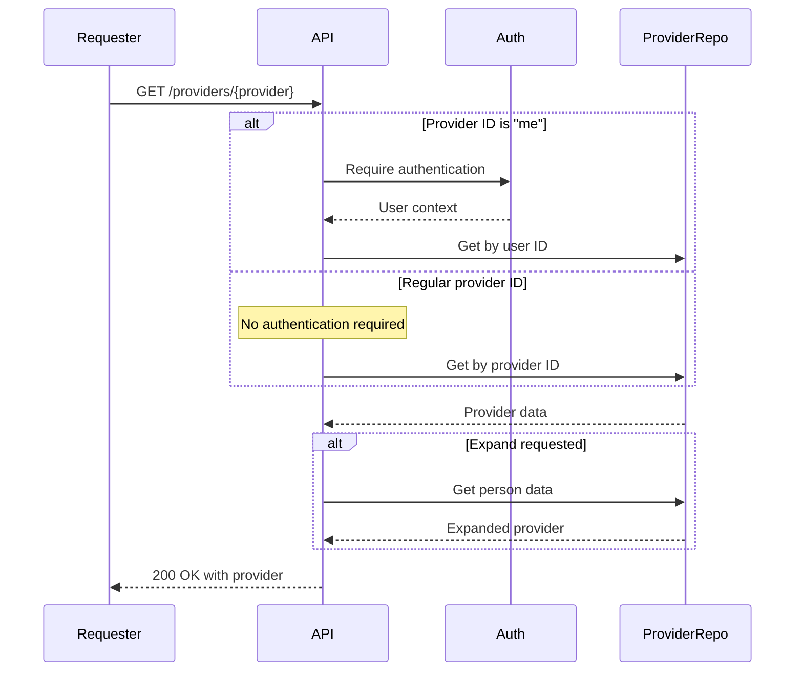

# Provider Module

## Overview

The Provider module serves as the healthcare provider profile system within the Monobase Application Platform. This module manages basic provider information including type, experience, and minor ailment specialties while maintaining integration with the Person module for personal information.

The module acts as a streamlined provider directory, supporting basic provider profiles and facilitating patient-provider discovery through public search capabilities.

## Core Concepts

### Person Module Extension Architecture
The system enforces the following architectural patterns:
- Each Provider record has a `personId` that references a Person record
- This ensures separation between personal data (in Person) and professional data (in Provider)
- Provider creation requires an existing Person record with verified identity
- A Person can have at most one Provider record (1:1 relationship)
- The same Person may simultaneously have Patient and Provider records

### Provider Type Classification
The design supports provider categorization:
- Providers have a provider type classification
- The system currently supports pharmacist and other provider types
- Additional provider types can be added as the platform evolves

### Minor Ailments Support
The module accommodates:
- Minor ailment specialty tracking
- Practice location recording for minor ailment services
- Support for Canadian pharmacy minor ailments programs

## Data Models

### Provider Entity
The Provider entity includes the following fields:

```typescript
interface Provider {
  // Base Entity Fields (Required)
  id: string;              // UUID, system-generated
  createdAt: Date;         // Automatic timestamp
  updatedAt: Date;         // Automatic timestamp
  deletedAt?: Date;        // For soft deletion
  version: number;         // Optimistic locking
  createdBy: string;       // Audit trail
  updatedBy: string;       // Audit trail

  // Person Association (Required)
  person: UUID | Person;   // Reference to Person record or expanded object

  // Professional Classification (Required)
  providerType: ProviderType;          // Provider type classification
  
  // Professional Information (Optional)
  yearsOfExperience?: number;          // Years in practice (0-70)
  biography?: string;                  // Professional biography (max 2000 chars)
  
  // Minor Ailments Practice (Optional)
  minorAilmentsSpecialties?: string[];
  minorAilmentsPracticeLocations?: string[];
}
```

### Supporting Types

#### ProviderType Enumeration
```typescript
enum ProviderType {
  pharmacist = "pharmacist",
  other = "other"
}
```

## API Documentation

### Create Provider
`POST /providers`

Creates a provider profile for a user.

**Authentication**: Required (Bearer token)
**Required Role**: `user`

**Request Body**:
```typescript
{
  person?: PersonCreateRequest;        // Optional person demographic info
  providerType: ProviderType;         // Required
  yearsOfExperience?: number;         // Optional, 0-70
  biography?: string;                  // Optional, max 2000 characters
  minorAilmentsSpecialties?: string[]; // Optional
  minorAilmentsPracticeLocations?: string[]; // Optional
}
```

**Response**: `201 Created` (ApiCreatedResponse<Provider>)

**Notes**:
- If person data is not provided, user should have an existing Person record
- User cannot already have a Provider record

### Get Provider
`GET /providers/{provider}`

Retrieves provider information.

**Authentication**: Not required (public access)
**Special Case**: Use 'me' as provider ID to get current user's profile (requires authentication)

**Path Parameters**:
- `provider`: UUID or 'me' for current user's profile

**Query Parameters**:
- `expand`: Include related data (e.g., `person`)

**Response**: `200 OK` (ApiOkResponse<Provider>)

### Update Provider
`PATCH /providers/{provider}`

Updates provider information.

**Authentication**: Required
**Required Role**: `provider:owner`

**Request Body**:
```typescript
{
  yearsOfExperience?: number | null;   // 0-70
  biography?: string | null;           // Max 2000 chars
  minorAilmentsSpecialties?: string[] | null;
  minorAilmentsPracticeLocations?: string[] | null;
}
```

**Response**: `200 OK` (ApiOkResponse<Provider>)

**Notes**:
- Only certain fields can be updated
- Null values clear the respective fields

### List Providers
`GET /providers`

Lists and searches providers.

**Authentication**: Not required (public access)

**Features**:
- Text search across provider information
- Specialty filtering
- Location filtering
- Pagination support

**Query Parameters**:
- `minorAilmentsSpecialty`: Filter by minor ailment specialty
- `minorAilmentsPracticeLocation`: Filter by minor ailment practice location
- `expand`: Include related data
- Standard pagination parameters (limit, offset)

**Response**: `200 OK` (ApiOkResponse<PaginatedResponse<Provider>>)

### Delete Provider
`DELETE /providers/{provider}`

Soft deletes a provider record.

**Authentication**: Required
**Required Role**: `provider:owner`

**Response**: `204 No Content` (ApiNoContentResponse)

**Notes**:
- Only providers can delete their own records

## Workflows

### Provider Registration Flow

The system implements simple provider registration:



### Provider Search Flow

The system enables public provider search:



### Provider Profile Update Flow

The system manages profile updates:



### Provider Access Control Flow

The system enforces access patterns:



## Implementation Notes

### Repository Pattern
The ProviderRepository extends the base DatabaseRepository and provides provider-specific data access methods:

```typescript
class ProviderRepository extends DatabaseRepository<Provider, NewProvider, ProviderFilters> {
  // Required Methods:
  findByPersonId(personId: string): Promise<Provider | null>
  findByUserId(userId: string): Promise<Provider | null>
  createWithPerson(data: ProviderCreateRequest, userId: string): Promise<Provider>
  searchProviders(filters: ProviderFilters): Promise<PaginatedResponse<Provider>>
  getWithPerson(providerId: string): Promise<ProviderWithPerson>
  buildWhereConditions(filters?: ProviderFilters): SQL<unknown>
}
```

### Repository Features
The repository implements:
- Person Join Support: Joining with Person table for demographic data
- Text Search: Basic search across provider information
- JSONB Field Management: Storing minor ailment arrays as JSONB
- Soft Delete Support: Logical deletion with deletedAt timestamp
- Unique Constraint: One provider record per person

### Query Optimization
The repository optimizes:
- Person table joins for expanded queries
- Indexed searches on person_id foreign key
- Provider type indexing for filtering
- JSONB field access for minor ailment data

## Security Considerations

### Role-Based Access Control
- **Create**: Requires `user` role
- **Read**: Public access (no authentication required)
- **Read Own Profile**: Via 'me' endpoint (requires authentication)
- **Update**: Requires `provider:owner`
- **Delete**: Requires `provider:owner`
- **List**: Public access (no authentication)

### Privacy Compliance
- Provider profiles are public by default
- All modifications must be logged with user context
- Limited fields exposed publicly
- Providers can remove their profiles via soft delete

### Data Protection
- Access logging tracks profile access patterns
- Update tracking via updatedBy field
- Secure JSONB storage for array fields
- Demographic data protected in separate Person module

### Person Module Integration
The Provider module integrates with Person through:
```sql
-- Provider table foreign key specification
ALTER TABLE provider 
ADD CONSTRAINT fk_provider_person 
FOREIGN KEY (person_id) REFERENCES person(id)
ON DELETE CASCADE;

-- Unique constraint for one provider per person
CREATE UNIQUE INDEX providers_person_id_unique ON provider(person_id);

-- Performance index
CREATE INDEX providers_person_id_idx ON provider(person_id);
```

### Patient Module Integration
The architecture enables:
- Provider information storage in Patient records
- Provider name and specialty in ProviderInfo
- Simple provider-patient associations

### Module Integration Points
The Provider module provides extension points for:
- Booking Module: Provider availability and scheduling
- Communication Module: Provider messaging capabilities
- Billing Module: Merchant account reference for payments
- Reviews Module: Provider ratings and feedback

### Billing Integration

The provider module integrates with the billing module to enable providers to receive payments:

#### Merchant Account Relationship
- Merchant accounts are linked to providers via the **Person** entity
- Relationship: `Provider.person → Person ← MerchantAccount.person`
- Providers can have Stripe Connect accounts for receiving payments
- Not all providers need merchant accounts (free consultations remain possible)

#### Payment Flow Integration
When a provider offers paid services, the merchant account is found via the person relationship:

```typescript
// Provider record
const provider = {
  id: "provider-uuid",
  person: "person-uuid"
};

// Find merchant account via JOIN on person
const merchantAccount = await db
  .select()
  .from(merchantAccounts)
  .innerJoin(providers, eq(merchantAccounts.person, providers.person))
  .where(eq(providers.id, provider.id));

// When creating invoices for this provider's services
const invoice = await billingAPI.createInvoice({
  customer: patientId,
  merchant: provider.person,        // Person who receives payment
  context: `appointment:${appointmentId}`,
  // ... other fields
});
```

#### Key Integration Points
1. **Person-Centric**: The `provider.person` field is used as the merchant in invoices
2. **Transitive Relationship**: Merchant account found via JOIN on person (1:1 provider-person, 1:0..1 person-merchant account)
3. **Optional Payments**: Providers without merchant accounts can still offer free services
4. **Separate Management**: Merchant account creation/management handled by billing module
5. **Loose Coupling**: No direct FK between provider and merchant account, linked via person

### Error Handling
- `400 Bad Request`: Invalid input or validation failures
- `401 Unauthorized`: Missing authentication (for protected endpoints)
- `403 Forbidden`: Insufficient permissions for operation
- `404 Not Found`: Provider not found
- `409 Conflict`: Provider record already exists for user

### Validation Requirements
- **providerType**: Must be valid enum value
- **yearsOfExperience**: Must be 0-70 when provided
- **biography**: Maximum 2000 characters when provided
- **minorAilmentsSpecialties**: Array of strings
- **minorAilmentsPracticeLocations**: Array of strings

### Business Rules
- One provider record per person maximum
- Person record must exist or be created with provider
- Provider type cannot be changed after creation
- Null values in updates clear the respective fields
- Soft deletes maintain data integrity

### Provider Creation Pattern
```typescript
// Required approach for provider creation
let personId: string;

if (request.person) {
  // Create or update person if data provided
  const person = await personRepo.createOrUpdate(request.person, user.id);
  personId = person.id;
} else {
  // Use existing person
  const person = await personRepo.findByUserId(user.id);
  if (!person) {
    throw new BadRequestError('Person profile required');
  }
  personId = person.id;
}

// Check for existing provider
const existingProvider = await providerRepo.findByPersonId(personId);
if (existingProvider && !existingProvider.deletedAt) {
  throw new ConflictError('Provider record already exists');
}

// Create provider
const provider = await providerRepo.createOne({
  person: personId,
  providerType: request.providerType,
  yearsOfExperience: request.yearsOfExperience,
  biography: request.biography,
  minorAilmentsSpecialties: request.minorAilmentsSpecialties,
  minorAilmentsPracticeLocations: request.minorAilmentsPracticeLocations,
  createdBy: user.id,
  updatedBy: user.id
});
```

### Provider Search Pattern
```typescript
// Required search implementation
const searchProviders = async (filters: ProviderFilters) => {
  const query = providerRepo.createQueryBuilder();
  
  // Text search
  if (filters.q) {
    // Search across person name (via join) and biography
    query.leftJoin('person', 'person.id', 'provider.person_id')
         .where(function() {
           this.whereILike('person.firstName', `%${filters.q}%`)
               .orWhereILike('person.lastName', `%${filters.q}%`)
               .orWhereILike('provider.biography', `%${filters.q}%`);
         });
  }
  
  // Minor ailments specialty filter
  if (filters.minorAilmentsSpecialty) {
    query.whereJsonContains('minorAilmentsSpecialties', filters.minorAilmentsSpecialty);
  }

  // Minor ailment practice location filter
  if (filters.minorAilmentsPracticeLocation) {
    query.whereJsonContains('minorAilmentsPracticeLocations', filters.minorAilmentsPracticeLocation);
  }
  
  // Filter active records
  query.whereNull('provider.deletedAt');
  
  // Pagination
  return query.paginate(filters.offset, filters.limit);
};
```

### Provider Update Pattern
```typescript
// Required update pattern
const updateProvider = async (providerId: string, updates: ProviderUpdateRequest, userId: string) => {
  const provider = await providerRepo.findOneById(providerId);
  if (!provider) {
    throw new NotFoundError('Provider not found');
  }
  
  // Check ownership
  if (provider.person !== user.personId) {
    throw new ForbiddenError('Access denied');
  }
  
  // Prepare updates
  const updateData: Partial<Provider> = {};
  
  if ('yearsOfExperience' in updates) {
    updateData.yearsOfExperience = updates.yearsOfExperience;
  }
  
  if ('biography' in updates) {
    updateData.biography = updates.biography;
  }
  
  if ('minorAilmentsSpecialties' in updates) {
    updateData.minorAilmentsSpecialties = updates.minorAilmentsSpecialties;
  }
  
  if ('minorAilmentsPracticeLocations' in updates) {
    updateData.minorAilmentsPracticeLocations = updates.minorAilmentsPracticeLocations;
  }
  
  updateData.updatedBy = userId;
  updateData.updatedAt = new Date();
  
  return await providerRepo.updateOne(providerId, updateData);
};
```

### Access Control Pattern
```typescript
// Required access control for GET /providers/{provider}
if (providerId === 'me') {
  // Require authentication for 'me' endpoint
  if (!user) {
    throw new UnauthorizedError('Authentication required');
  }
  
  const provider = await providerRepo.findByUserId(user.id);
  if (!provider) {
    throw new NotFoundError('No provider profile found');
  }
  return provider;
}

// Public access for regular provider IDs
const provider = await providerRepo.findOneById(providerId);
if (!provider || provider.deletedAt) {
  throw new NotFoundError('Provider not found');
}

return provider;
```

### Performance Optimization

#### Database Optimization
- Person join index on person_id for efficient joins
- Provider type index for filtering by provider type
- Soft delete index on deletedAt for active record filtering
- JSONB GIN indexes for minor ailment arrays
- Unique constraint to prevent duplicate providers per person

#### Query Optimization
- Person table joins when expand parameter is used
- Text search across joined tables
- JSONB containment queries for specialties
- Pagination for list operations
- Simple field updates without full record loads

### Monitoring and Analytics

#### Metrics
- Provider registration rates
- Profile update frequency
- Search query patterns
- API response times by endpoint
- Public vs authenticated access patterns

#### Operational Metrics
- List endpoint performance
- Search filter usage
- Expand parameter usage
- Error rates by operation

#### Audit Requirements
All operations generate audit logs including:
- User identifier (createdBy/updatedBy)
- Provider identifier
- Action performed (create/read/update/delete)
- Timestamp
- Success/failure status

## Design Rationale

The Provider module design creates a streamlined provider directory system by:

1. **Extending Person Architecture**: Maintains separation between personal and professional data while enabling dual patient-provider roles
2. **Public Accessibility**: Open provider directory enables patient discovery without authentication barriers
3. **Simple Data Model**: Focus on essential provider information reduces complexity while meeting core requirements
4. **Minor Ailments Support**: Specific support for Canadian pharmacy minor ailments programs
5. **Flexible Provider Types**: Support for 14 different healthcare provider classifications
6. **Future Extensibility**: Simple base structure allows for future enhancements like credentials, scheduling, and verification

The architecture provides a practical starting point for provider management that can be enhanced over time with additional features such as credential verification, availability management, and comprehensive practice information as the platform grows.